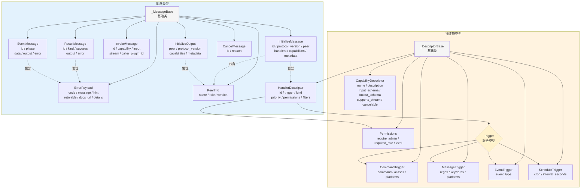
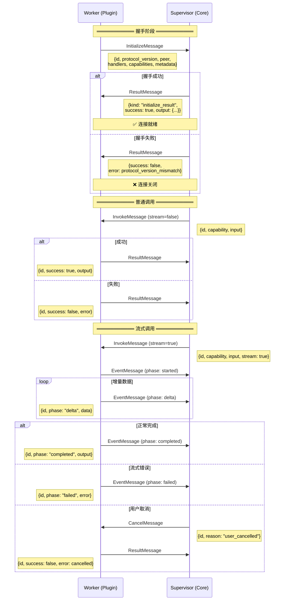

# v4 协议图表

## 1. 协议类型体系



## 2. 完整交互流程



## 3. 系统架构与状态

```mermaid
flowchart TB
    subgraph Supervisor进程
        direction TB
        SR[SupervisorRuntime]
        SP[Peer]
        CR[CapabilityRouter]
        HD[HandlerDispatcher]

        SR --> SP
        SR --> CR
        CR --> SP
        SP --> HD
    end

    subgraph Transport层
        direction LR
        T1[StdioTransport<br/>子进程管道]
        T2[WebSocketTransport<br/>网络连接]
    end

    subgraph Worker进程
        direction TB
        WR[WorkerSession]
        WP[Peer]
        GR[GroupWorkerRuntime]
        PR[PluginWorkerRuntime]

        WR --> WP
        WR --> GR
        GR --> PR
    end

    SP <-->|"协议消息"| T1
    T1 <-->|"协议消息"| WP
    SP <-->|"协议消息"| T2
    T2 <-->|"协议消息"| WP

    style Supervisor进程 fill:#e3f2fd
    style Worker进程 fill:#e8f5e9
    style Transport层 fill:#fff3e0

    subgraph 能力命名空间
        direction TB
        Root[能力命名空间]

        Root --> LLM[llm.*]
        Root --> MEM[memory.*]
        Root --> DB[db.*]
        Root --> PLAT[platform.*]
        Root --> PERM[permission.*]
        Root --> SYS[system.*]
        Root --> HND[handler.* ❌]
        Root --> INT[internal.* ❌]

        LLM --> L1[llm.chat]
        LLM --> L2[llm.stream_chat]
        MEM --> M1[memory.search]
        DB --> D1[db.get / db.set]
        PLAT --> P1[platform.send]
        PERM --> PE1[permission.check]

        style HND fill:#ffcccc
        style INT fill:#ffcccc
    end

    subgraph 调用状态机
        direction LR
        [*] --> Sent: InvokeMessage

        Sent --> WaitResult: stream=false
        Sent --> WaitEvents: stream=true

        WaitResult --> Done: ResultMessage
        WaitEvents --> Started: started
        Started --> Delta: delta
        Delta --> Delta: delta
        Delta --> Done: completed
        Delta --> Fail: failed

        Delta --> Cancelled: CancelMessage
        Cancelled --> Done

        Done --> [*]
        Fail --> [*]
    end
```
