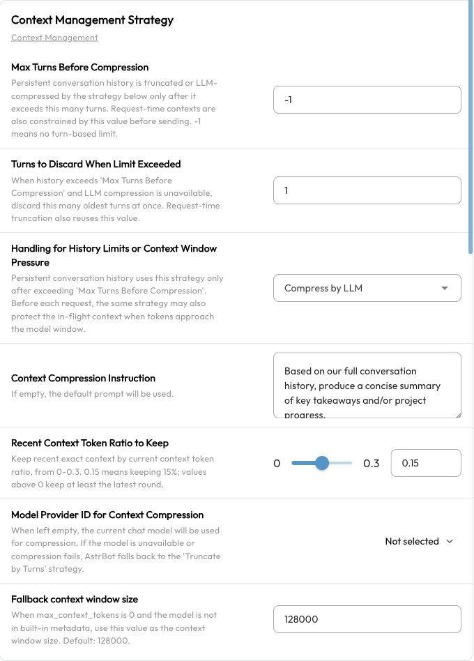

# Context Compression

As a conversation grows, AstrBot sends more previous messages and tool results to the model. This material forms the model's **context**, consumes its context window, and increases the number of input tokens.

Context compression reduces older material so a conversation can continue. AstrBot can remove earlier turns or ask a model to summarize them. These settings apply to **AstrBot Built-in AI**; third-party execution modes such as Dify and Coze manage context on their own platforms.

> [!NOTE]
> Compression helps with long conversations but cannot preserve every detail. Store long-term reference material in a [knowledge base](./knowledge-base.md) or files rather than relying only on chat history.

## Quick Setup

1. Open **Config** in the WebUI sidebar and select the profile your bot uses.
2. Go to **AI → Advanced → Context Management Strategy**. If this section is missing, confirm that you are using AstrBot Built-in AI and that **Enable AI** is on. See [Agent Execution Mode](./agent-runner.md) for switching modes.
3. Choose a strategy under **Handling for History Limits or Context Window Pressure**. New profiles default to **Compress by LLM**.
4. To get started, keep the recent context ratio at `0.15` and leave the compression model empty to use the current chat model. Keep **Max Turns Before Compression** at `-1` to avoid an additional turn-based history limit.
5. Click **Save Configuration** at the bottom right.

These settings belong to the selected profile. Check each profile separately if your bots use different ones.

## Two Strategies {#compression-strategies}

| Strategy | What happens to older material | Suitable for |
| --- | --- | --- |
| Truncate by Turns | Removes earlier turns without producing a summary | Lower latency and cost when earlier topics are no longer needed |
| Compress by LLM | Asks a model to summarize older material and keeps some recent context unchanged | Long discussions or Agent tasks that need to continue unfinished work |

LLM compression adds a model request, which takes time and may incur a charge. Summaries can omit details; truncation discards the removed material entirely.

### LLM Compression Settings

| Setting | Meaning and recommendation |
| --- | --- |
| Model Provider ID for Context Compression | Leave empty to use the current session's chat model, or choose a configured chat model. Its context window must be large enough for the material being summarized. |
| Recent Context Token Ratio to Keep | Defaults to `0.15`: a budget of 15% of the current context's tokens is used to retain recent content unchanged. The range is `0–0.3`. AstrBot keeps whole turns rather than cutting at an exact token boundary; a positive ratio keeps at least the latest turn. |
| Context Compression Instruction | Leave empty for the default prompt. A custom prompt can ask the summary to preserve the task goal, completed steps, key conclusions, file paths, and next actions. |

The default summary focuses on the user's goal, task progress, conclusions, useful tool results, and materials already read so work can continue. If the selected compression model is unavailable, AstrBot tries the current chat model. If it cannot generate a summary, it falls back to removing older turns.

## When Context Is Processed

### 1. A Request Approaches the Model's Context Limit

AstrBot checks context **before every model request**, including follow-up requests after an Agent calls tools. The selected strategy is triggered when context usage exceeds approximately **82%** of the model's context window.

AstrBot checks again after processing. If the context is still too long, it removes complete turns from the oldest first while keeping the latest turn. Tool calls and their results are handled together to avoid leaving incomplete call records.

If the latest turn alone is too large, automatic compression may still be unable to fit the request into the model's window. Reduce the size of the input or tool output, or choose a model with a larger context window.

### 2. A Configured Turn Limit Is Reached

**Max Turns Before Compression** adds a history length limit. Its default, `-1`, means no turn-based limit. With a positive value, AstrBot also truncates earlier material to enforce this limit before checking token usage. **Turns to Discard When Limit Exceeded** controls how many turns are removed at once and defaults to `1`.

To favor summarizing older information over early turn-based removal, keep the limit at `-1` and use LLM compression. `-1` does not disable automatic token-based compression.

## Set the Model's Context Window Correctly {#️-important-model-context-window-settings}

Compression depends on the actual chat model's context window. A value that is too large can allow requests to fail before compression starts; a value that is too small triggers compression unnecessarily early.

1. Open **Providers → Chat Completion**.
2. Select the provider on the left and edit the configured model on the right.
3. Set **Model context window size** (`max_context_tokens`) to the window size published by the provider and save.

See [Chat Models](../providers/llm.md) for model setup.

When `max_context_tokens` is `0`, AstrBot tries to look up the model ID in its built-in [MODELS.DEV](https://models.dev/) metadata. If the model is unknown, it uses **Fallback context window size**, which defaults to `128000`. Setting the value to `0` therefore does not disable compression, nor does it guarantee recognition of custom model names.

For an unrecognized model, set an accurate `max_context_tokens` value instead of relying on the default fallback.

## Common Questions

### Why Are Earlier Details Missing After Compression?

A summary does not retain every word, and truncation removes older content altogether. You can specify important information in the compression instruction, increase the recent context ratio, or put long-term reference material in a knowledge base. Increasing the ratio leaves less room to release through compression.

### Why Has Compression Not Started?

Check that you edited the profile used by the current session and saved it. Token compression normally waits until usage exceeds approximately 82% of the context window. An oversized window setting can delay it.

### Why Do I Still Get a Context Limit Error?

Check the window sizes of both the chat model and the compression model. One large message, file, or tool result can make the latest turn exceed the limit on its own. Compression does not discard the current task indefinitely; reduce the input size and try again.

### How Do I Start Fresh?

Send `/reset` to clear the current conversation context or `/new` to create a new conversation. See [Built-in Commands](./command.md) for commands and wake-prefix settings.
