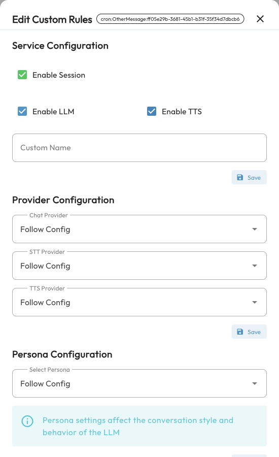

# Custom Rules

Custom rules let you make exceptions for **one specific session** without duplicating an entire configuration profile for every group or private chat. For example:

- Give a work group a professional persona and a specific chat model while other sessions keep their defaults.
- Let one group use plugin commands without automatic AI replies.
- Disable voice replies or selected plugins in a private chat.
- Choose specific knowledge bases for one session.

These rules take priority over the corresponding settings in the session's profile. Settings without an override keep their normal behavior. Rules do not create models, personas, plugins, or knowledge bases; set up those resources on their own pages first.

## Identify the Session (UMO)

A UMO (Unified Message Origin) identifies a particular session on a platform instance. Custom rules belong to the **UMO**, not a user's display name or the title of the current conversation.

Send `/sid` in the group or private chat you want to configure, then compare its UMO with the session shown in the WebUI. Similar names across platforms and chats can be confusing; checking the UMO helps you select the right source. See [Built-in Commands](./command.md) for command and wake-prefix details.

> [!NOTE]
> Per-member conversation isolation in groups affects how sessions are identified. Use the UMO returned for the actual target message. Creating a new conversation within a session does not remove that UMO's custom rules.

## Add Your First Rule

1. Have a conversation with the bot in the target group or private chat so AstrBot records the source.
2. Open **Custom Rules** in the WebUI sidebar.
3. Click **Add Rule**, select the target under **Select Session**, and click **Next**. If the session already has rules, use its edit button in the list instead.
4. Change the settings in **Edit Custom Rules**, for example the chat model under **Provider Configuration**.
5. Click **Save beneath the section you changed**. Service, provider, persona, plugin, and knowledge base sections save separately. Save each changed section.
6. Send a new message in the target session to check the result.

Saved rules take effect without restarting AstrBot. The older **Session Management** and **More Features → Custom Rules** entry points now correspond to **Custom Rules** directly in the sidebar.

## Available Settings

| Section | Setting | Purpose |
| --- | --- | --- |
| Service Configuration | Enable Session | Turning this off stops processing messages from this source, including normal AI replies and plugin responses. Re-enable it from the WebUI. |
| Service Configuration | Enable LLM | Turning this off stops normal AI conversation processing for the session. Plugin commands can still work; each plugin controls its own behavior. |
| Service Configuration | Enable TTS | Controls whether the session can use synthesized speech output. A TTS model and the relevant profile settings must already be configured. |
| Service Configuration | Custom Name | Adds a note to help identify the session without changing its UMO. |
| Provider Configuration | Chat Provider, STT Provider, TTS Provider | Selects configured models for this session, or **Follow Config**. |
| Persona Configuration | Select Persona | Forces a persona for this session. Leaving it empty removes the forced-persona rule. |
| Plugin Configuration | Disabled Plugins | Disables selected plugins in this session without affecting other sessions. |
| Knowledge Base Configuration | Select Knowledge Bases, Top K Results | Overrides the profile's knowledge base selection and number of retrieval results. |

Service switches control whether the session may use features already configured. Checking LLM or TTS does not enable a feature disabled in the profile or configure a model automatically.

See [WebUI](./webui.md), [Plugins](./plugin.md), and [Knowledge Base](./knowledge-base.md) for the underlying persona, plugin, and knowledge base setup.

## Rules Versus Configuration Profiles

A **profile** configures a complete set of bot behavior, such as models, wake conditions, message processing, and tools. A **custom rule** changes selected settings for an individual session.

For example, two groups may use the `default` profile while only group A needs a different chat model. Add a model rule for group A without affecting group B. If you later change the chat model in `default`, group A still uses its override until you remove the rule or select **Follow Config**.

A rule cannot load a plugin that has been disabled globally. Enable it on the **Plugins** page first, then use custom rules to disable it in selected sessions.

## Edit Rules and Restore Defaults

Search for the session or its note in the list, then use the edit button. Each section has its own save button.

- **Models:** Select **Follow Config** and save to remove that model override.
- **Persona:** Clear the selection and save to remove the forced-persona rule and restore normal persona selection.
- **Plugins:** Remove a plugin from the disabled list and save. Clearing the list removes the session's plugin-disable rule.
- **Knowledge bases:** Clear the selection and save to remove the session-level rule and restore the profile's knowledge base settings. **This does not disable knowledge bases.**
- **Entire session:** Use the delete button in the list and confirm to remove all custom rules for that UMO.

Deleting rules does not delete models, plugins, knowledge bases, or chat history.

## Batch Operations and Groups

Use **Batch Operations** below the rules list to change multiple sessions:

1. Select sessions in the list, or choose all sessions, all groups, all private chats, or a custom group under **Apply to**.
2. Select the LLM or TTS status or chat model to change.
3. Click **Apply Changes**, then check the target sessions.

Only the selected settings are changed. Start with a few selected sessions before applying changes to a wider scope.

**Group Management** lets you organize related sessions into a named group and use that group as a batch-operation scope. A group does not automatically make its members inherit shared rules; apply the batch changes after adding members.

## Common Questions

### My Session Is Missing from Add Rule

Have a conversation with the bot in that session, then refresh the page or reopen **Add Rule**. Sessions with existing rules are excluded from the add list; edit them in the main list instead.

### Why Does a Session Keep Its Old Model or Persona After I Change the Profile?

Check for rules on that UMO. Session overrides still take priority. Select **Follow Config**, clear the forced persona, or remove the rule, then test again.

### I Disabled the Session. Why Does a Command Not Re-enable It?

Disabling session processing prevents its messages from reaching later processing stages. Re-enable the session in the WebUI instead of relying on commands sent in the disabled chat.

### A Saved Change Has No Effect

Check the target UMO, the save result for the section you edited, and the availability of the selected resource. Test with a new message; rules do not rewrite replies that have already been generated.
