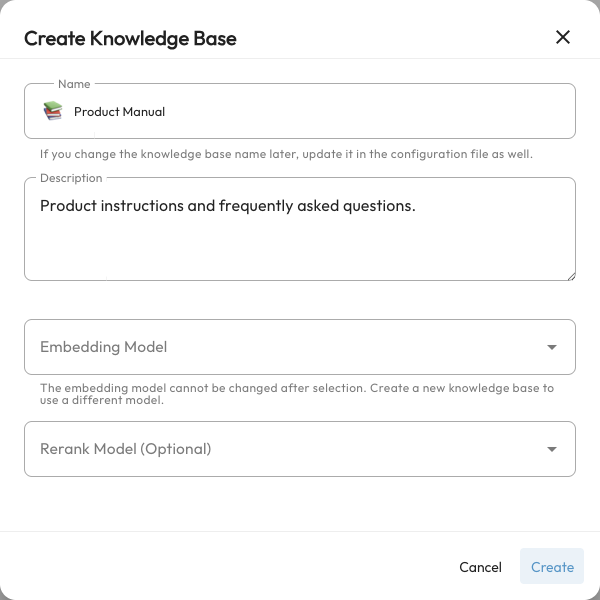
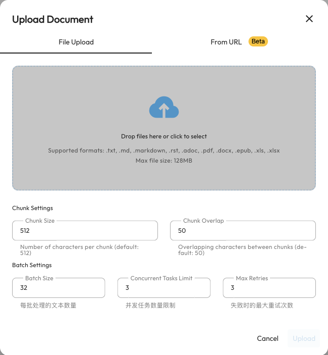

# AstrBot Knowledge Base

A knowledge base lets AstrBot answer questions using material you provide. Upload product manuals, FAQs, course notes, or project documentation, and the Agent can retrieve relevant passages before composing an answer.

For example, upload a community onboarding guide so the bot can answer “How do I join the project?” or “Where do I report a problem?” without putting the entire document in its persona prompt.

This is retrieval-augmented generation (RAG). During upload, AstrBot extracts text, splits it into chunks, and builds an index. During chat, it retrieves relevant chunks and passes them to the chat model. Uploading documents does not train or fine-tune that model, and answers can still be incorrect.

## Understand the three model roles

| Model | Required? | Role |
| --- | --- | --- |
| Chat model | Required to answer questions | Reads retrieved passages and generates the answer |
| Embedding model | Required to create a knowledge base | Converts documents and queries into vectors for semantic retrieval |
| Rerank model | Optional | Scores candidate passages again to put more relevant results first |

Embedding and chat models are configured separately. A model that only supports chat cannot be used as an embedding model. Start with one chat model and one embedding model; add reranking later if needed.

This page covers AstrBot's current built-in knowledge base, available since 4.5.0. It does not require a knowledge base plugin.

## Step 1: Configure an embedding model {#configuring-embedding-model}

1. Open `Providers` (`/providers`) in the sidebar.
2. Select the `Embedding` tab, click `Add`, and choose a provider.
3. Enter the service's API endpoint, API key, model name, vector dimensions, and other required settings.
4. Save and make sure the provider is available.

Current integrations include OpenAI-compatible services, Google Gemini, Ollama, Alibaba Cloud Model Studio, and NVIDIA embedding services. For `OpenAI Embedding`, use the service's API base URL and an embedding model name, not a chat model name.

For local services such as Ollama, the endpoint must be reachable from the environment running AstrBot. In Docker, `localhost` points to the AstrBot container, not automatically to your host machine.

Vector dimensions must match the model's actual output. Vectors from different models are not interchangeable; consult the provider's model documentation if unsure.

### Configure a reranker (optional) {#configuring-reranker-model-optional}

To add reranking, create and save a corresponding provider under `Providers → Rerank`. You can create, upload to, and use a knowledge base without one.

::: tip Where is the content sent?
With a remote embedding service, document text and retrieval queries are sent to that service. Retrieved passages are sent to the chat model when it answers. Choose model services appropriate for your material.
:::

## Step 2: Create a knowledge base {#creating-a-knowledge-base}

1. Open `Knowledge Base` (`/knowledge-base`) in the sidebar and click `Create Knowledge Base`.
2. Enter a recognizable name, such as “Community Onboarding,” and a description.
3. Select the provider you configured under `Embedding Model`.
4. Optionally select a `Rerank Model`; otherwise leave it empty.
5. Click `Create`.



You can create several knowledge bases—for example, one for product manuals and another for community rules—and choose one or more for a conversation.

::: warning Changing embedding models requires a new knowledge base
The embedding model selection is locked after creation. Do not change the model or vector dimensions of the provider used by an existing knowledge base: its index would become incompatible. To switch models, add a new provider, create a new knowledge base, and upload the original documents again.
:::

## Step 3: Upload material {#uploading-files}

### Upload files

1. Open the knowledge base and select `Documents`.
2. Click `Upload Document` and keep the `File Upload` tab selected.
3. Select or drag in files. You can select multiple files at once.
4. Keep the default chunking and batch settings for your first attempt, then click `Upload`.
5. Wait for parsing, chunking, and embedding to finish. Confirm that the document list shows the documents and their chunk counts.



Supported formats are `.txt`, `.md`, `.markdown`, `.rst`, `.adoc`, `.pdf`, `.docx`, `.epub`, `.xls`, and `.xlsx`. The upload interface lists a maximum of 128 MB per file. Split large collections by topic to make them easier to process and maintain.

PDFs should contain extractable text. Scanned, image-only PDFs are not automatically processed with OCR; convert them to text or searchable PDFs first. Complex document or spreadsheet layouts can also affect extraction. Inspect the chunks after uploading.

### Choose chunking settings

Chunking splits a long document into passages suitable for retrieval.

| Setting | Purpose | Starting recommendation |
| --- | --- | --- |
| Chunk Size | Controls passage size in characters | Start with the default 512 and adjust based on results |
| Chunk Overlap | Retains context shared by adjacent passages | Start with 50; keep it smaller than the chunk size |
| Batch Size | Number of chunks submitted to the embedding service per batch | Keep the default 32 |
| Concurrent Tasks Limit | Limits concurrent processing tasks | Start with 3; lower it if the service rate-limits requests |
| Max Retries | Retries failed tasks | Keep the default 3 |

Changing a knowledge base's default chunk settings affects later uploads. It does not automatically split existing documents again. Re-upload documents when you need to change their chunking.

### Import from a web URL

Switch the upload dialog to `From URL` and enter a public page URL. This feature is currently in beta and uses **Tavily** to extract HTML content. It reads the Tavily key from the **default profile**. Follow the interface prompt to configure that key; credentials for another search provider cannot replace it.

`Enable Content Cleaning` optionally uses the selected chat model to clean and organize extracted content, incurring additional model calls. Pages requiring login, blocking crawlers, or failing content extraction may not import. Imported content is a snapshot; later website changes are not synchronized automatically.

## Step 4: Test retrieval first

A successful upload does not enable the knowledge base in chat. First open the knowledge base's `Retrieval` tab:

1. Enter a question whose answer is in a document, such as “How can a newcomer join the project?”
2. Click `Search` and inspect the passages and their source documents.
3. Confirm that the passages contain the answer before connecting the knowledge base to chat.

This page tests retrieval, not a chat model's generated answer. If no relevant passage appears, check the documents and chunks first.

## Step 5: Use it in a conversation {#using-the-knowledge-base}

1. Open `Config` and choose the profile your bot or ChatUI actually uses.
2. Under `AI → Capabilities → Knowledge Base`, select one or more entries in `Knowledge Base List`.
3. Keep the default retrieval counts for your first attempt.
4. Click `Save Configuration` at the bottom right.
5. Ask about the uploaded material in the corresponding conversation.

```text
Using the community onboarding guide, explain how to join the project. If the material does not cover a detail, say so.
```

Documents do not become permanent model memory. The relevant knowledge base must be selected by the current profile or a session rule. Different profiles can use different knowledge bases; creating one does not enable it for every bot.

### Standard versus Agentic retrieval

| Mode | When retrieval happens | Chat model requirement |
| --- | --- | --- |
| Standard retrieval (default) | Retrieves using the current message and appends relevant passages to the model request | Does not require knowledge base tool calling |
| `Agentic Knowledge Base Retrieval` | Exposes retrieval as a tool; the model decides when and how to query it | The model and its API must support tool calling |

Keep the default mode if you want retrieval before each answer. With Agentic retrieval enabled, the model may answer without querying the knowledge base. For testing, explicitly ask it to query first.

### Adjust result counts

`Fusion Search Results Count` controls the candidate count after results from multiple knowledge bases are fused. `Final Results Count` controls how many passages reach the model. Their defaults are 20 and 5.

Too few results can miss an answer; too many increase input length and noise. Start with the defaults and adjust based on the actual passages returned by the retrieval test.

### Choose a knowledge base for one group or private chat

Under `Custom Rules` (`/session-management`), assign knowledge bases and a retrieval count to a specific message source. Session selections override the profile. Clearing the selection and saving removes the override and restores the profile's knowledge bases. See [Custom Rules](./custom-rules.md).

## Maintain a knowledge base

- **Inspect documents**: Use a document's view action under `Documents` to check its parsed chunks.
- **Update material**: Delete the outdated document and upload its replacement so contradictory versions are not retrieved together. Keep copies of the originals.
- **Tune retrieval**: Under `Settings`, adjust dense and sparse retrieval counts or select a rerank provider. Dense retrieval focuses on semantic similarity; sparse retrieval focuses on word matching.
- **Rename carefully**: Profiles select knowledge bases by name, so update affected profiles after renaming one.
- **Delete carefully**: Deleting a document removes its chunks. Deleting a knowledge base removes its documents and index. These operations cannot be undone; keep backups first.

## Troubleshooting

### Creation or upload fails

Check that the embedding provider is saved and available, its model name, endpoint, and dimensions are correct, and its key has quota. Inspect the error under `Data & Logs → Logs`. Lower the batch size or concurrency if the service rate-limits requests.

### Upload completed, but retrieval misses the answer

Inspect the chunks. Was the text extracted correctly? Does it contain the relevant keywords? Is the PDF only scanned images? Try a more specific question in `Retrieval`, then adjust chunking, result counts, or add a reranker if needed.

### The retrieval test works, but the bot does not use the answer

Check the conversation's profile selection and any session overrides. In Agentic mode, also check that the model and its API support tool calling. The model may still ignore retrieved material; a persona instruction such as “Prefer retrieved sources and do not invent details when they are insufficient” can help.

### Vector dimension errors after switching models

The existing index is incompatible with the new embedding model. Restore the original provider settings, or create a new knowledge base and re-upload with the new model. Changing a dimension field alone does not convert stored vectors.

## Example: SiliconFlow embeddings

With [SiliconFlow](https://cloud.siliconflow.cn/), obtain a key from its console and add an `OpenAI Embedding` provider:

- API key: Your SiliconFlow key.
- API base URL: `https://api.siliconflow.cn/v1`.
- Model: An embedding model currently offered by the service, such as `BAAI/bge-m3`; set dimensions according to its model documentation.

Available models, pricing, and free quotas may change. Check the platform's current information, then follow the creation, upload, and retrieval testing steps above.

You can also enable [Web Search](./websearch.md) for current public information. A knowledge base is suited to material you maintain; the two capabilities complement each other.
