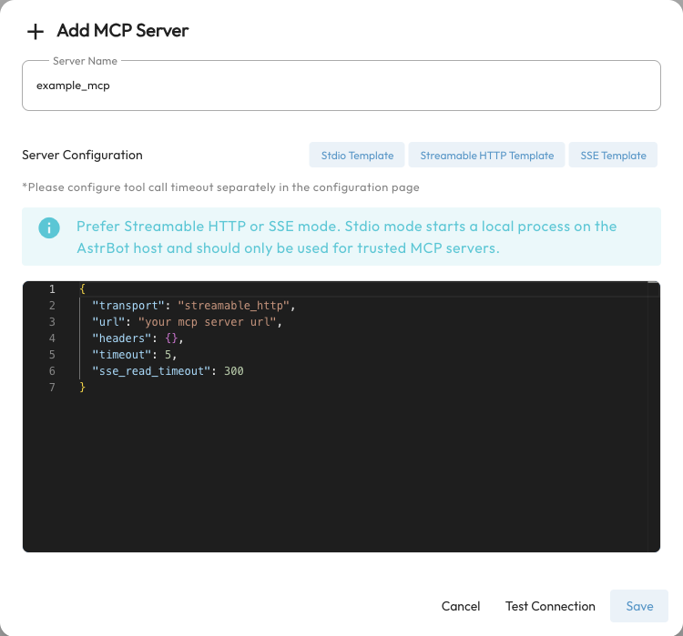

# MCP

MCP (Model Context Protocol) is an open protocol that connects AI applications to external tools and data services. Think of an MCP server as a collection of tools that an AI can call: the server provides capabilities, while AstrBot connects to it, makes its tools available to the Agent, and uses their results to answer the user.

For example, a paper-search server lets the Agent respond to “Find recent papers about RAG” by actually searching for papers. A calendar server may let it look up appointments. The available actions depend on the server's tools and account permissions. MCP does not automatically grant access to every website or computer.

## Before You Start {#initial-configuration}

- Configure a working chat model that supports tool calling, and use AstrBot's built-in AI execution mode. Support in third-party Agent execution modes depends on their integration.
- Choose an MCP server and read its instructions for the transport, configuration, dependencies, and access token requirements.
- Check that it provides the **tools** you need. This integration primarily makes MCP tools available to the AstrBot Agent.

MCP works alongside [plugins](/en/use/plugin) and [Skills](/en/use/skills): plugins extend AstrBot's commands and message handling; MCP connects tools provided by independent services; Skills supply reusable task workflows.

## Choose a Connection Method

Open `Extensions → MCP Servers` (`/extension/mcp`) in WebUI. The entry previously shown on the standalone tools page is now in the MCP tab of the Extensions workspace.

AstrBot supports these three transports. **If a provider gives you a remote endpoint, start with Streamable HTTP. It does not require a local Node.js or uv installation.**

| Transport | When to use it | What to prepare |
| --- | --- | --- |
| Streamable HTTP | A provider's service or a remotely deployed MCP server | MCP endpoint and optional authentication headers |
| SSE | A remote server using the older SSE transport | SSE endpoint and optional authentication headers |
| stdio | Launching an MCP program in AstrBot's runtime environment | Python, uv, Node.js, or other dependencies required by that server |

Use the transport specified by the server. A regular webpage or REST API URL is not necessarily an MCP endpoint; an SSE endpoint is not interchangeable with a Streamable HTTP endpoint.

### Prepare a stdio Environment

**Install only what your chosen server requires.** Python servers may use `uv` / `uvx`, while Node.js servers often use `npx`. Remote connections do not require installing both.

Install dependencies in **the environment where AstrBot runs**. For a source deployment, use the same account and environment as AstrBot. For Docker, install them inside the container; installing them only on the host is insufficient.

The official Docker image built from the current repository includes Node.js and uv. Older or third-party images may differ. Check first, replacing `astrbot` with your container name:

```bash
docker exec astrbot uv --version
docker exec astrbot node --version
docker exec astrbot npx --version
```

If uv is missing, use `Install pip Package` on `Data & Logs → Logs` to install `uv`, or run:

```bash
docker exec astrbot python -m pip install uv
```

For Node.js in a source deployment, follow the [Node.js download instructions](https://nodejs.org/en/download). For Docker, update to an image with the required dependencies or add them to your Dockerfile. Packages manually installed inside a container may disappear when it is recreated.

If AstrBot cannot find a newly installed command, restart AstrBot to pick up environment changes, or use an absolute executable path in `command`. Escape Windows paths in JSON, for example `C:\\tools\\node.exe`.

## Add Your First MCP Server {#installing-mcp-servers}

1. Open `Extensions → MCP Servers` and click the **+** button at the bottom right.
2. Enter a recognizable **Server Name**, such as `arxiv`.
3. Choose the appropriate template, paste the server's JSON into **Server Configuration**, and replace any endpoints, paths, and tokens.
4. Click **Test Connection** to check connectivity and discover tools.
5. Click **Save**. When adding a server, AstrBot checks the connection again and connects it. The list should then show **Connected** and its available tools.



Add one server at a time. If a service supplies a complete configuration wrapped in `mcpServers`, you can paste the configuration object for one server. AstrBot also accepts the wrapper format, but a single add operation does not import every server inside it.

### Remote Streamable HTTP Example

This illustrates the configuration format. `example.com` is a placeholder and cannot be used for a real connection test. Use the endpoint and authentication scheme provided by your service:

```json
{
  "transport": "streamable_http",
  "url": "https://example.com/mcp",
  "headers": {
    "Authorization": "Bearer YOUR_TOKEN"
  },
  "timeout": 30,
  "sse_read_timeout": 300
}
```

If authentication is unnecessary, remove `headers` or set it to `{}`. For an SSE server, change `transport` to `sse` and enter its SSE endpoint.

### stdio Example: Search Papers {#an-example}

[arxiv-mcp-server](https://github.com/blazickjp/arxiv-mcp-server) documents a uv-based launch configuration:

```json
{
  "command": "uv",
  "args": [
    "tool",
    "run",
    "arxiv-mcp-server",
    "--storage-path",
    "data/arxiv"
  ]
}
```

The first launch may download dependencies. Follow the server's latest README for current arguments. In Docker, store downloaded papers and other persistent files under your mounted `data` directory, using container paths.

For environment variables, use the JSON `env` object directly. This is a format example; replace the command, package, and variable names with those required by your server:

```json
{
  "command": "uvx",
  "args": ["your-mcp-package"],
  "env": {
    "API_TOKEN": "YOUR_TOKEN",
    "API_URL": "https://example.com"
  }
}
```

`command` identifies an executable, and `args` contains separate arguments rather than a complete shell command. Current versions validate stdio launchers. The older `command: "env"` example and shell wrappers such as `bash -c` are not supported; put environment variables in `env` instead.

> [!NOTE]
> stdio launches a local process in AstrBot's runtime environment. Use trusted servers and configure their permissions as needed. The Agent's local isolation settings do not automatically isolate this MCP server process.

## Let the Agent Use MCP Tools

After connecting, make sure the tools are available to the current conversation:

1. Open **Personas** and edit the persona used by that conversation.
2. Under **Persona Capabilities**, find the MCP server in the tools list. Select the entire server, or use its cog button to choose individual tools, then save the persona.
3. Make sure the conversation uses that persona and describe the task naturally, for example, “Search for recent multimodal RAG papers and give me their titles and links.”

The default persona uses all available capabilities. Create or edit a custom persona to restrict the selection. Selecting a globally disabled tool in a persona does not enable it again.

**Connected means the service is reachable; it does not guarantee the model will call a tool.** Tool use depends on the model, persona, task, and tool descriptions. External tools such as MCP searches do not require Computer Use. Configure an [execution environment and permissions](/en/use/astrbot-agent-sandbox) only when AstrBot itself needs to execute code or access files.

## Manage and Sync Servers

- **View tools:** click the available-tool count to see the server's tool names.
- **Edit:** click a server entry, update its JSON, and save.
- **Connect / Disconnect:** use the switch on the right. Its tools become unavailable when disconnected.
- **Delete:** remove the server configuration from AstrBot. This does not uninstall a stdio program or delete a remote service.
- **Sync from ModelScope:** use the sync button at the bottom right. Follow the dialog to obtain a personal access token and synchronize servers. Configure the desired MCP services on ModelScope first.

## Troubleshooting

| Symptom | What to check first |
| --- | --- |
| Invalid JSON | Missing quotes, trailing commas, or explanatory text pasted into the configuration |
| `uv`, `npx`, or `node` not found | Whether the executable is available in AstrBot's environment; Docker users must check inside the container |
| stdio command not allowed | Do not put a whole shell command in `command`; use the supported Python/Node.js/uv launcher and put variables in `env` |
| Remote service returns 401 / 403 | Token validity and the authentication headers required by the provider |
| Docker cannot reach `localhost` | Inside a container, `localhost` means that container. Use a reachable host address; Docker Desktop commonly supports `host.docker.internal` |
| Connected but no tools | Whether the server provides MCP tools and the account has permission; inspect server logs and `Data & Logs → Logs` |
| Tools exist but the Agent does not call them | Model tool-calling support, persona selection, and global tool status; try a task that clearly needs the tool |
| Tool times out | Separate connection delays from slow tool execution. Connection settings belong in MCP JSON; search for the tool-call timeout setting in Config to adjust execution time |

Hide real tokens before sharing configuration, screenshots, or logs. Keep field names visible when troubleshooting.

## Further Reading

- [Official MCP documentation](https://modelcontextprotocol.io/docs/getting-started/intro)
- [Official MCP server examples](https://github.com/modelcontextprotocol/servers)
- [awesome-mcp-servers](https://github.com/punkpeye/awesome-mcp-servers)
- [ModelScope MCP directory](https://www.modelscope.cn/mcp)
