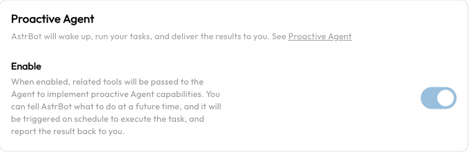
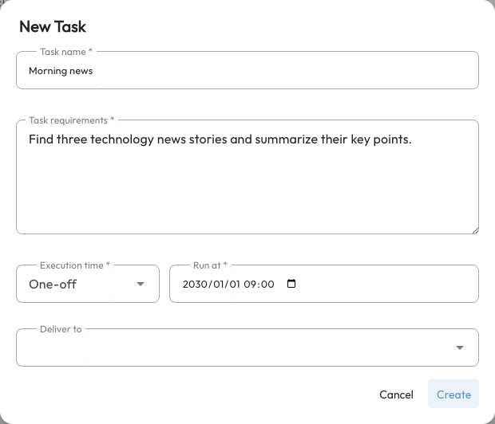

# Proactive Capabilities

Proactive capabilities let AstrBot run tasks at scheduled times without waiting for another user message. For example: “Remind me to take a break in ten minutes,” or “Search for technology news every morning and send a summary to this group.” When triggered, the Agent follows the task instructions, calls its model and tools, and attempts to send results to the target conversation.

This is not continuous autonomous monitoring. Create a task first and keep AstrBot running. Search, file access, and other capabilities need their own configuration. Introduced in v4.14.0, this feature is still **experimental**.

<span id="how-to-use"></span>

## Configure the prerequisites

1. In **Config**, choose the profile used by the target conversation. Open **AI**, enable AI, and select **AstrBot Built-in AI**.
2. Confirm that the chat model works and supports tool calling.
3. Open **AI → Capabilities → Proactive Agent**, enable it, and click **Save Configuration**. This provides the `future_task` tool for managing tasks through chat.
4. Under **Extensions → Future Tasks**, click **Supported platforms** to check that the receiving platform is configured and supports proactive messaging.



Each profile can control whether its chat Agent receives the scheduling tool. **Turning this setting off does not delete or pause existing tasks.** Disable or delete those tasks on the Future Tasks page.

## Create tasks through chat {#future-tasks-futuretask}

<span id="features"></span>

In the private or group conversation that should receive the result, tell AstrBot:

```text
Remind me to take a break in ten minutes, just once.
```

For a recurring task:

```text
Every day at 9 AM Asia/Shanghai time, search for three technology news items. Send their titles, brief summaries, and source links to this group.
```

The model calls `future_task` to create a schedule. Do not rely only on “OK, scheduled”: open Future Tasks and verify the instructions, execution time, next run, and delivery target. A news task also requires [Web Search](./websearch.md).

You can also ask it to:

- “List the future tasks I created in this conversation.”
- “Move my break reminder to 3 PM tomorrow.”
- “Delete the news task I just created.”

Chat-based listing, editing, and deletion are limited to tasks created by **the current sender in the current conversation**. Group members cannot edit or delete each other's tasks. Tasks created in the WebUI do not belong to a chat sender; administrators should manage them in the WebUI.

## Create and manage tasks in the WebUI

Open **Extensions → Future Tasks** and click **New Task**. You do not need to ask the model to create it first.



| Field | Meaning and example |
| --- | --- |
| Task name | A recognizable name, such as “Daily technology briefing.” |
| Task requirements | Instructions the Agent executes when woken. Specify sources, steps, result format, and whether to send the result. |
| Schedule | Choose one-off, interval, daily, weekly, monthly, or custom. |
| Deliver to (optional) | Select an existing conversation. Leaving it empty allows execution but does not automatically deliver results to a user or group. |

If no conversations appear, talk to AstrBot on the target platform first, then return to select it. The target is identified by a UMO (unified message origin), which includes the platform, message type, and conversation identifier.

The list shows each schedule, delivery target, and next run. Search by name or content, or filter by target. Click a task to edit it, use its switch to disable scheduled execution, and use **More actions** for **Run now** or **Delete**. Hover over its timing information to see the last execution time and any recorded error.

- **Disabling** preserves the task while pausing scheduled triggers.
- **Run now** really executes the task. It may call paid models or external services and send messages. It also works for disabled tasks.
- Running a one-off task manually does not delete it or replace its scheduled run. After a test, check whether you still need the schedule.
- One-off tasks are deleted after their scheduled execution, **even if execution fails**. Recurring tasks remain and continue on their schedule.

## Schedules and time zones

Start with daily or weekly time selectors. A custom schedule uses a five-field Cron expression:

```text
minute hour day-of-month month day-of-week
```

| Expression | Meaning |
| --- | --- |
| `0 9 * * *` | Every day at 09:00. |
| `0 17 * * fri` | Every Friday at 17:00. |
| `0 9 1 * *` | The first day of each month at 09:00. |

Recurring schedules use the task's time zone. New WebUI tasks default to the target conversation's configuration time zone, or the system time zone if none is specified. The one-off date/time picker uses the browser's local time and converts it to an absolute timestamp. Verify the resulting schedule when browser, server, and container time zones differ.

The interval selector currently creates Cron calendar steps, rather than a timer measured from creation. For example, every two hours runs at even-numbered hours. Minute, hour, and day steps are capped at 59, 23, and 31 respectively; day steps across months are not a fixed elapsed duration. Monthly tasks on the 29th, 30th, or 31st do not run in months without that date.

AstrBot must be online to execute tasks. Saved schedules are reloaded after a restart, but do not depend on it replaying every missed reminder. Start with a one-off task a few minutes ahead to check timing and delivery.

## What a scheduled task can use

Tasks use the target conversation's configuration and conversation context. Later changes to models, Personas, and tools can affect subsequent runs. Put required details in the task instructions instead of writing only “do what we discussed.” Tasks without a delivery target use a separate scheduling conversation and the default configuration.

Scheduling does not grant extra capabilities:

- For current information, configure [Web Search](./websearch.md).
- For file operations or code execution, configure [Agent Sandbox](./astrbot-agent-sandbox.md).
- For a business service, configure its [plugin](./plugin.md) or [MCP](./mcp.md).

### Supported Platforms

Execution and delivery are separate. Successful execution does not guarantee that a platform will accept a message. Platform permissions, conversation identifiers, connection state, proactive-message windows, and media formats all affect delivery. Check **Supported platforms** on the page and your platform's documentation; an old fixed platform list is not a complete support reference.

## Sending multimedia messages

<span id="features-1"></span>

AstrBot includes the `send_message_to_user` tool for text, images, voice recordings, videos, files, and mentions. The Agent can use it to send content it has generated or retrieved, including scheduled task results.

The tool does not itself generate images or audio. Generation requires the appropriate model or tool. Files must be accessible to the Agent, and supported media types depend on the platform.

## Verification and troubleshooting

Create a one-off task a few minutes ahead that sends a short test reminder. Confirm it appears in the list, verify the time, and keep AstrBot running until delivery. Test complex tasks in an ordinary conversation before scheduling them.

| Problem | What to check |
| --- | --- |
| Agent says “scheduled” but the list is empty | Check the conversation's profile, Proactive Agent setting, tool-capable model, and whether `future_task` was actually called. |
| Task exists at the wrong time | Check the profile, server/container, and browser time zones, then verify the displayed next run. |
| Nothing runs at the scheduled time | Check the task switch, AstrBot uptime, model, and services. Look for task errors under **Data & Logs → Logs**. |
| Task ran but no message arrived | Check the delivery target, platform support, connection, and send permissions. No target means no automatic delivery. |
| Search or file operations fail | Test those tools' configuration, dependencies, and permissions separately. Scheduling only wakes the Agent. |
| A one-off task disappeared | Scheduled execution deletes it even on failure. Inspect logs for the outcome. |
| Chat cannot find an existing task | Query as the original sender in the original conversation. Use the WebUI for tasks created by others or by the dashboard. |
