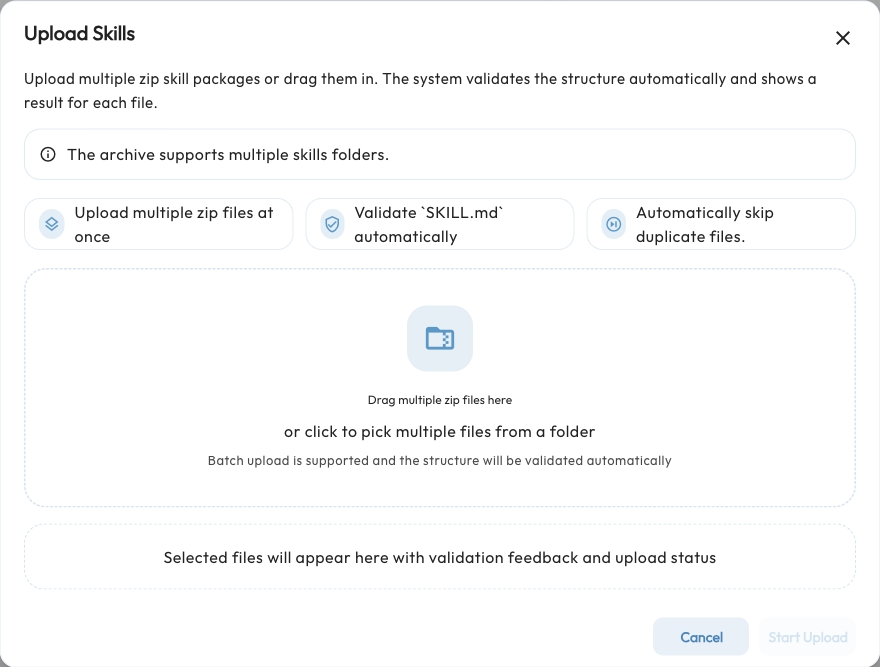

# Skills {#anthropic-skills}

A Skill is a task manual for an Agent. It packages instructions, rules, templates, and reference material in a folder whose core file is `SKILL.md`. It can also include scripts and examples.

For example, a weekly-report Skill can explain how to group progress, blockers, and next steps into a consistent format. A spreadsheet Skill can describe data cleaning and file generation. The user describes a task; the Agent checks Skill names and descriptions, reads the relevant instructions, and loads supporting resources as needed.

AstrBot has supported this Agent Skills format since v4.13.0. It is not limited to Claude models, but the model must understand the instructions. Reading files, calling tools, and running scripts also require the corresponding capabilities.

## How Skills Differ from Tools {#key-features}

| Type | What it provides | Example |
| --- | --- | --- |
| Tool | A specific operation | Search the web, read a file, execute Python |
| [MCP](/en/use/mcp) | Tools from an external service | Query calendars, search papers |
| Skill | A task workflow and supporting resources | Write reports using a team template, analyze tables using defined rules |
| [Plugin](/en/use/plugin) | AstrBot extensions | Register commands, handle messages, and optionally provide tools or Skills |

AstrBot first provides Skill names, descriptions, and file paths to the Agent. The Agent reads detailed content as needed rather than loading every file at the start. **Uploading a Skill does not install its software dependencies or grant permissions.** Configure any required Python packages, APIs, or tools separately.

## Upload Your First Skill {#uploading-skills-to-astrbot}

1. Prepare a `.zip` Skill package from a trusted source.
2. Open `Extensions → Skills` in WebUI and click the **+** button at the bottom right. The former standalone Skills entry is now in the Extensions workspace.
3. Select files or drag ZIP files into the dialog. Multiple ZIP files are supported.
4. Click **Start Upload** and inspect each file's result. Return to the list and confirm the installed Skill is enabled.



Duplicate filenames in the upload queue are skipped. Uploading does not overwrite an existing local Skill with the same name. Before updating, download a backup, then edit its local files or delete the old Skill and upload it again.

### ZIP Structure

A recommended archive contains one or more Skill folders, each with `SKILL.md` directly inside it. Keep the filename capitalization consistent:

```text
skills.zip
├── weekly-report/
│   ├── SKILL.md
│   └── references/
│       └── report-template.md
└── table-analysis/
    ├── SKILL.md
    └── scripts/
        └── analyze.py
```

A ZIP with `SKILL.md` directly at its root is also supported. For a root-level package or an archive containing just one Skill folder, WebUI uses the ZIP filename without `.zip` as the installed identifier. For a multi-Skill package, it uses each Skill folder's name. To avoid confusion, give a single-Skill archive the same name as its folder, such as `weekly-report.zip`.

Use English letters, numbers, dots, underscores, or hyphens for identifiers. Avoid wrapping Skills in an extra repository folder that has no `SKILL.md`, and do not simply rename another file type to `.zip`.

### A Minimal SKILL.md

This example demonstrates a description and workflow. The `description` should state **what the Skill does and when to use it**, so the Agent can decide whether to load it:

```markdown
---
name: weekly-report
description: Use when the user wants to turn scattered work notes into a weekly report with progress, blockers, and next steps.
---

# Weekly Report

1. Read the user's work notes; ask for any missing essential information.
2. Group completed work, ongoing work, and blockers.
3. Output sections named Progress, Issues and Risks, and Next Week.
4. Preserve dates, owners, and key figures. Do not invent progress.
```

Save it as `weekly-report/SKILL.md`, archive it as `weekly-report.zip`, and upload it. For a fuller format reference, see the [Agent Skills specification](https://agentskills.io/specification) and [Claude Skills documentation](https://code.claude.com/docs/en/skills).

## Configure the Runtime and Persona {#using-skills-in-astrbot}

### Give the Agent Access to Skill Files

Open `Config → AI → Capabilities → Agent Computer Use`, choose a runtime, and save:

- **Local:** the Agent uses file tools in AstrBot's runtime environment. Members and administrators follow separate local permission policies. Reading instructions can use workspace file access without code execution. Running Skill scripts additionally requires execution permission and their dependencies.
- **Sandbox:** the Agent reads files and runs scripts in a separate environment. Configure the sandbox connection first. AstrBot attempts to synchronize local and plugin Skills to active sandboxes.
- **None:** a Skill inventory may still reach the model, but Computer Use file and execution tools are unavailable. Reading the full instructions is not guaranteed, and Skill scripts cannot run. Configure Local or Sandbox for practical Skill use.

See [Agent Sandbox](/en/use/astrbot-agent-sandbox) for file scopes, code execution, networking, and deployment. Skills do not bypass these restrictions or automatically grant regular members permission to execute code.

### Select Skills for the Current Persona

1. Open **Personas** and edit the persona used by the conversation.
2. Select Skills under **Persona Capabilities**. Plugin-provided Skills are grouped by plugin; use the cog button to select individual Skills.
3. Save the persona and ensure the conversation uses it. The default persona uses all available capabilities; use a custom persona to restrict the selection.
4. Ask, “Use the weekly-report Skill to organize these notes,” and supply the notes. You can also describe a matching task and let the Agent choose the Skill.

A Skill may be unavailable because it is disabled, its plugin is disabled, or the persona has not selected it. Installation, global availability, persona selection, and runtime permissions are separate settings.

## Manage Installed Skills

The `Extensions → Skills` list supports searching names, descriptions, and sources:

- **Enable / Disable:** use the switch on the right. Disabling keeps the files for later use.
- **View and edit:** click a local Skill to open the file editor and inspect instructions, references, or scripts. Editable text files can be modified and saved.
- **Download:** export a local Skill as a ZIP for backup or migration.
- **Delete:** remove a local Skill and its files. Use **Select** for batch deletion.
- **Refresh:** update the list after manually changing files.

Plugin-provided Skills can be read but cannot be edited, downloaded, or deleted here; manage them through their plugin. Sandbox presets cannot be edited, deleted, or enabled/disabled from the local Skills page. These source restrictions do not indicate a loading failure.

## Skill Sources and Priority

AstrBot discovers Skills from these locations. Workspace Skills are available to the current request rather than the global management list:

| Source | Location or discovery method | Management |
| --- | --- | --- |
| Local Skills | WebUI uploads or `data/skills/<skill_name>/SKILL.md` | Skills page |
| Plugin-provided Skills | A plugin's `skills/` directory | Managed by the plugin; also subject to the current config profile's plugin selection |
| Sandbox presets | Skills discovered inside the sandbox | Managed by the sandbox; start at least one sandbox session to populate discovery |
| Workspace Skills | `skills/<skill_name>/SKILL.md` inside the current session workspace | Discovered per request in Local runtime; not shown in the global Skills list |

A workspace path is usually `data/workspaces/<normalized_umo>/skills/<skill_name>/SKILL.md`. UMO identifies the session, and its directory name is normalized. Workspace Skills are not written to the global configuration or automatically synchronized to third-party sandboxes yet.

For duplicate names, request-time priority is **Workspace > Local > Plugin > Sandbox-only**. A workspace override applies only to the current request.

A persona's explicit Skill list filters local, plugin, and sandbox Skills, **but not workspace Skills**. Explicitly selecting no Skills disables workspace Skills as well. When a local Skill has been synchronized to a sandbox, AstrBot treats it as the same Skill and uses its sandbox-readable path for sandbox requests.

### Shipyard Neo Skills

When the runtime is Sandbox and the driver is `shipyard_neo`, the page also offers a **Local Skills / Neo Skills** switch. Neo Skills shows candidates and release records, with evaluation, `Canary` / `Stable` promotion, synchronization, and deactivation/rollback actions.

This manages reusable Skill versions accumulated in Neo. It is not required for uploading ordinary ZIP packages. Start with local upload and execution; see [Third-Party Sandbox Environments](/en/use/astrbot-agent-sandbox#third-party-sandbox-environment) for Neo connection settings.

## Troubleshooting

| Symptom | What to check |
| --- | --- |
| Upload cannot find `SKILL.md` | A valid ZIP, with the file directly at the root or inside a Skill folder; remove any extra repository wrapper |
| A Skill with that name already exists | Upload does not overwrite it; download a backup, then edit it or delete and upload again |
| No description in the list | Ensure the opening YAML frontmatter contains a string `description` |
| Agent does not use the Skill | Mention its name explicitly; check global status, current persona, and file-reading capability |
| Instructions load but scripts fail | Check runtime, the user's execution/network permissions, and dependencies; a Skill does not install dependencies or elevate permissions |
| Plugin Skill is inactive or restricted | Check whether its plugin is enabled; plugin files are managed by that plugin |
| Sandbox presets are missing | Start one sandbox session and refresh; presets come from the discovery cache |
| Edit/delete actions are unavailable | Check whether this is a manageable local Skill rather than a plugin Skill or sandbox preset |

Skills may include scripts or calls to external services. Read their instructions, check dependencies and permissions, then validate the output with a small task.
