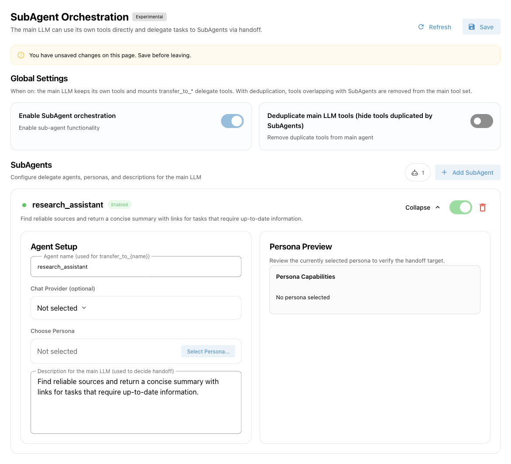

# SubAgent Orchestration {#agent-handoff-and-subagent}

A SubAgent is an AI assistant with a specific responsibility. The main Agent talks to the user, delegates suitable tasks to a SubAgent, and continues its response using the returned result.

<span id="motivation"></span>

For example, one SubAgent can research sources while another organizes files. Each uses its own Persona prompt and tool selection, and can optionally use a different chat model. This separates responsibilities and reduces the tools the main Agent must choose directly, but also adds model calls and waiting time. Simple conversations with only a few tools usually do not need orchestration.

Introduced in v4.14.0, this feature is still marked **experimental**. This page covers AstrBot's built-in AI. Orchestration provided by an external AI application is configured in that application.

## How it works

1. When enabled, the main Agent receives tools named `transfer_to_<name>`, such as `transfer_to_research_assistant`, alongside its own tools.
2. The main Agent reads each SubAgent's public description to decide whether to delegate. It passes a clear task and can include images when needed.
3. The SubAgent uses its Persona's prompt, preset dialogue, and tools to complete the task.
4. It returns the result to the main Agent, which organizes the response and continues the conversation.

The model decides when to delegate. Delegation is neither automatic for every message nor a fixed workflow. A SubAgent receives the delegated task and its own preset dialogue; it **does not automatically receive the main Agent's entire conversation history**. Include necessary background, file paths, and constraints in the task.

The delegation tool also supports background execution. The main Agent can acknowledge submission first and be woken again when the SubAgent finishes. Proactive delivery still depends on the chat platform; see [Proactive Capabilities](./proactive-agent.md).

## Create your first SubAgent {#configuration}

### 1. Prepare a model and Persona

Confirm that AstrBot's built-in AI can hold a conversation and that its chat model supports tool calling. Under **Extensions → Persona** in the WebUI, create a dedicated Persona, such as “Research Assistant”:

- Explain how it should collect information, verify sources, and present results.
- Select only the tools needed for research, such as configured web search or MCP tools.
- If it only analyzes text, it can have no tools.

The Persona describes **how the assistant works**. The public description explains **when the main Agent should ask for its help**.

<span id="_2-create-a-subagent"></span>

### 2. Add the SubAgent

Open **Extensions → SubAgents** (`/subagent`), click **Add SubAgent**, then click **Expand** on the new card.



| Setting | What to enter |
| --- | --- |
| Agent name | For example, `research_assistant`. Start with a lowercase English letter; use only lowercase letters, numbers, and underscores. Maximum 64 characters. Names must be unique. |
| Chat Provider (optional) | Select the SubAgent's chat model. Leave empty to use the chat provider resolved for the current conversation. This is not a separate API key field. |
| Choose Persona | Select the Persona you created. Its preview appears on the right. Required. |
| Description for the main LLM | Describe suitable tasks, required inputs, and expected results. Avoid vague descriptions such as “a powerful assistant.” |
| Enable switch | Controls whether this SubAgent participates in orchestration. New SubAgents are enabled by default. |

Example public description:

```text
Researches and verifies information. Delegate questions that need a comparison, recent information, or a summary of sources. Include the question and constraints. I return concise findings with source links.
```

Manage tools on the **Persona** page; the SubAgent page has no separate tool selector. A Persona with all tools selected can use currently available tools. A specific selection uses only matching tools that still exist and are enabled. Computer-use tools also require the appropriate runtime and permissions.

<span id="_1-enable-subagent-mode"></span>

### 3. Enable and save

Turn on **Enable SubAgent orchestration**, then click **Save** in the upper right. Adding, editing, disabling, or deleting a SubAgent, and changing either global switch, all require saving. Saving reloads orchestration without restarting AstrBot.

This page manages **global orchestration settings**, rather than a separate SubAgent list for the currently selected configuration profile.

## Deduplicate main LLM tools

By default, the main Agent can use its own tools directly or delegate. With **Deduplicate main LLM tools (hide tools duplicated by SubAgents)** enabled, overlapping tools assigned to enabled SubAgents are removed from the main Agent's tool list.

For example, if both have a search tool, the main Agent can search directly or delegate when deduplication is off. With deduplication on, it uses the research SubAgent for that search task.

<span id="best-practices"></span>

Start with deduplication off and enable it after confirming the SubAgent works. Giving every SubAgent all tools makes clear responsibilities difficult to maintain.

## Verify the setup

1. Check the required tools first: configure web search, connect the MCP service, and so on.
2. Send an explicit request, such as “Ask the research assistant to compare these two options and provide source links.”
3. Look for `transfer_to_research_assistant` and subsequent calls in the conversation's tool activity or **Data & Logs → Logs**.
4. Check that the answer follows the Persona's instructions before adding more SubAgents.

The model may still answer directly. Creating a SubAgent alone does not guarantee delegation.

## Limits and troubleshooting {#known-issues}

| Symptom | What to check |
| --- | --- |
| Cannot save | Check names, duplicates, and Persona selection, including disabled SubAgents. |
| Main Agent never delegates | Check both enable switches and saved settings. Use a tool-capable model and a specific public description. |
| SubAgent cannot use a tool | Check Persona tool selection, plugin/MCP status, runtime, and permissions. Selecting a disabled tool does not reactivate it. |
| Result lacks context | Specify the background and constraints to pass. Full conversation history is not automatically shared. |
| SubAgent model fails | Check that the selected Chat Provider exists and works, or clear it to use the conversation's model. |
| Persona changes are not reflected | Save the SubAgent page again to reload the Persona content. |

A SubAgent is not a separate container or account permission boundary. It calls tools in the current conversation's AstrBot environment. Configure file and execution isolation through [Agent Sandbox](./astrbot-agent-sandbox.md).

SubAgent execution history is not persisted as an independent conversation. There is no separate Skills isolation configuration. This page does not configure multi-level delegation and should not be treated as an arbitrarily nested tree of Agents.
