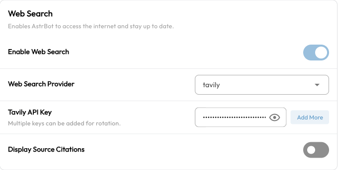

# Web Search

Web Search lets AstrBot's built-in AI call a search service while answering questions. It can find news, product updates, and public reference material—for example, check a software release, compare options, or read a web page and summarize it.

The model retrieves results and then uses them to compose its answer. Search supplements the model's existing knowledge, but results can still be outdated or inaccurate. Open the sources to verify important information.

## What you need

- **AstrBot Built-in AI**: Enable AI under `Config → AI` and select AstrBot Built-in AI as the execution mode. Search for third-party modes such as Dify or Coze is configured in the corresponding service.
- **A chat model with tool calling**: Both the model and the API used to access it must support Function Calling / Tool Calling.
- **A search service**: Choose a provider and obtain an API key if required. Search keys and chat model keys are separate credentials.
- **Network access**: The server or container running AstrBot must be able to reach the selected service's API.

Search uses built-in tools. You do not need a search plugin or Computer Use. The network permission for executing code applies to code execution, not to requests to search services.

## Enable Web Search

1. Open `Config` in the sidebar and choose the profile your conversation actually uses.
2. Open `AI → Capabilities` and locate `Web Search`.
3. Turn on `Enable Web Search` and choose a `Web Search Provider`.
4. Enter the provider's API key. Baidu AI Search uses a single key; other providers accept a list. One key is enough to start, and multiple keys can be rotated.
5. Click `Save Configuration` at the bottom right.



These settings belong to the selected profile. Changing `default` does not enable search for bots using another profile. See the [WebUI guide](./webui.md) for profile assignment.

## Choose a search provider

AstrBot supports seven providers. Configure one to start; you do not need an account with every service.

| Provider | Get a key | Capabilities available in AstrBot |
| --- | --- | --- |
| <span id="tavily">Tavily</span> | [Tavily dashboard](https://app.tavily.com/home) | Web search and page content extraction from a URL |
| <span id="bocha">BoCha</span> | [BoCha](https://bochaai.com/) | Web search |
| <span id="baidu-ai-search">Baidu AI Search</span> | [Baidu Cloud API key management](https://console.bce.baidu.com/iam/#/iam/apikey/list) | Baidu AI Search; requires access to the corresponding service |
| <span id="brave">Brave</span> | [Brave Search API](https://brave.com/search/api/) | Web search |
| <span id="firecrawl">Firecrawl</span> | [Firecrawl](https://firecrawl.dev/) | Web search and page content extraction from a URL |
| <span id="exa">Exa</span> | [Exa dashboard](https://dashboard.exa.ai/) | Keyword or semantic search, page contents, and filters such as domain and date |
| <span id="anysearch">AnySearch</span> | [AnySearch console](https://anysearch.com/console/api-keys) | General search and specialized retrieval for research, code documentation, finance, legal information, and other domains |

AnySearch uses anonymous mode with a daily free quota when its key list is empty. Other providers require their own keys. Check each service's website for current quotas, pricing, regional availability, and authorization requirements.

### Searching versus reading a link

Searching a topic returns results from a search service. Summarizing a specific link requires extracting that page's contents. Tavily, Firecrawl, and Exa currently provide dedicated page extraction tools; choose one of them if reading links is a common task.

Extraction cannot read every website. Pages behind a login or paywall, sites with anti-bot restrictions, and some pages rendered through scripts may fail.

## Use search in a conversation

After saving, send the bot or ChatUI a request with clear search intent:

```text
Search for AstrBot's latest release. Give the version, summarize the main changes, and include source links.
```

```text
Find the official bubblewrap documentation and explain what problems it helps solve.
```

With a provider that supports page extraction, you can also ask:

```text
Read this page and summarize its installation steps: https://docs.astrbot.app/en/deploy/astrbot/docker.html
```

The model decides whether to search, which keywords to use, and whether to read a page afterward. Enabling search does not make every message access the internet. Ask it to “search first, then answer” when you need current information.

ChatUI can display source references returned by some search tools. The result depends on the provider, whether the model cites results correctly, and the messaging platform. On platforms such as Telegram or QQ, ask the model to include source links directly.

## Troubleshooting

### The model answers without searching

Test with “Please perform a web search before answering…” and check that:

1. The conversation uses the profile you edited, with AstrBot Built-in AI selected.
2. The chat model and its API support tool calling.
3. The key was saved and the search service has quota remaining.

### Invalid key, quota, or request errors

Check the error under `Data & Logs → Logs`. `401` and `403` commonly indicate key or service permission problems; `429` commonly indicates a quota or rate limit. For timeouts, check connectivity from the AstrBot environment to the search API. Do not enter your chat model key in a search key field.

### Search works, but summarizing a link fails

Confirm that the provider supports page extraction and try a public page that does not require a login. If only one website fails, check that site's access restrictions.

### The old “default” provider stopped working after an upgrade

The legacy `default` search provider is no longer supported. Select a current provider, enter its credentials, enable search again, and save the configuration.

## Related capabilities

- [Knowledge Base](./knowledge-base.md): Use your uploaded manuals, FAQs, and internal material. Search is useful for public information that changes frequently.
- [SubAgent Orchestration](./subagent.md): Give search capabilities to an Agent responsible for gathering information.
- [MCP](./mcp.md): Add tools for other retrieval services through their MCP servers.
