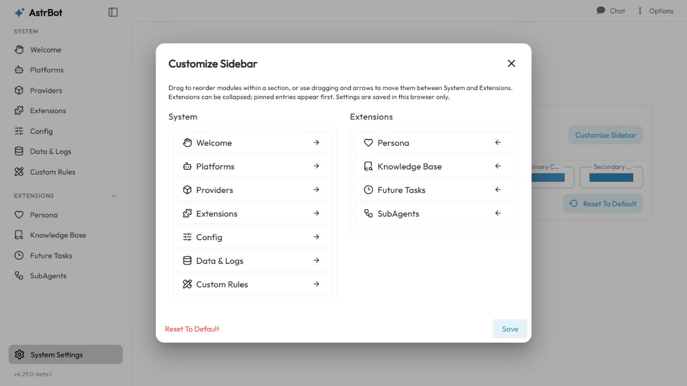
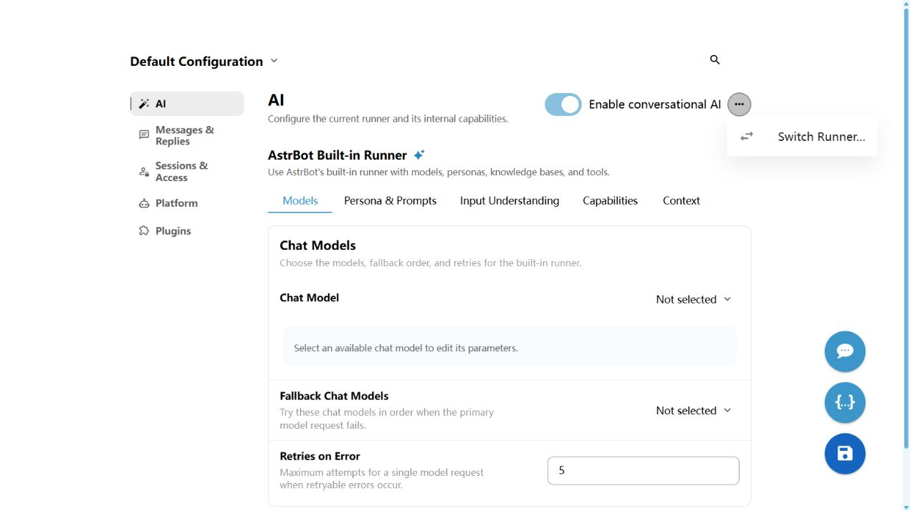
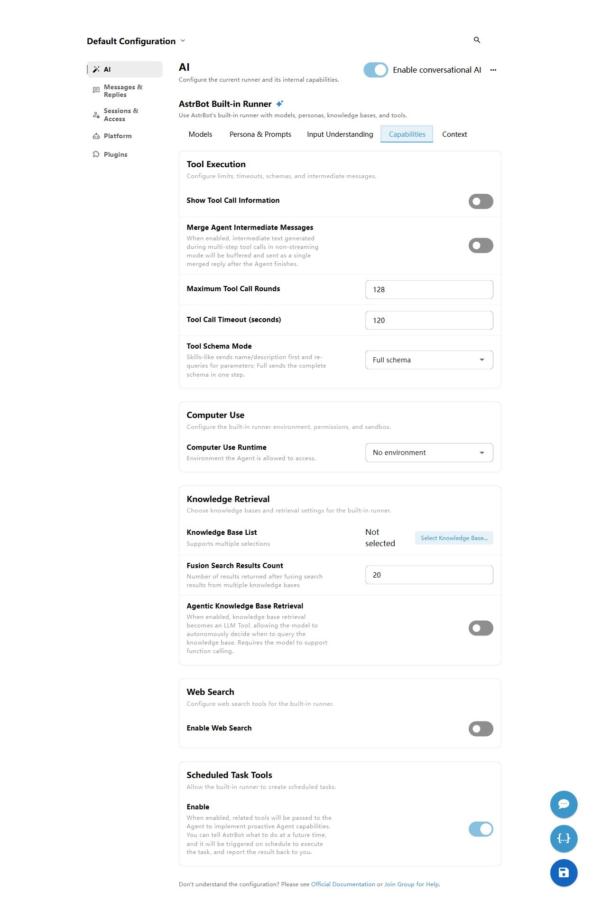
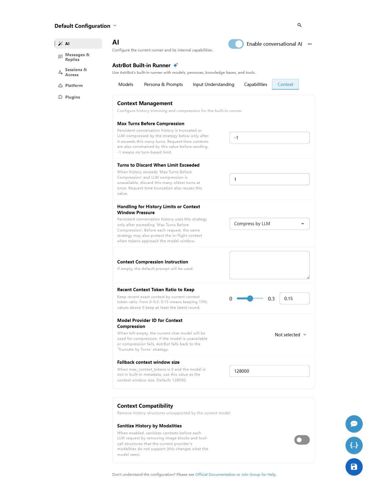
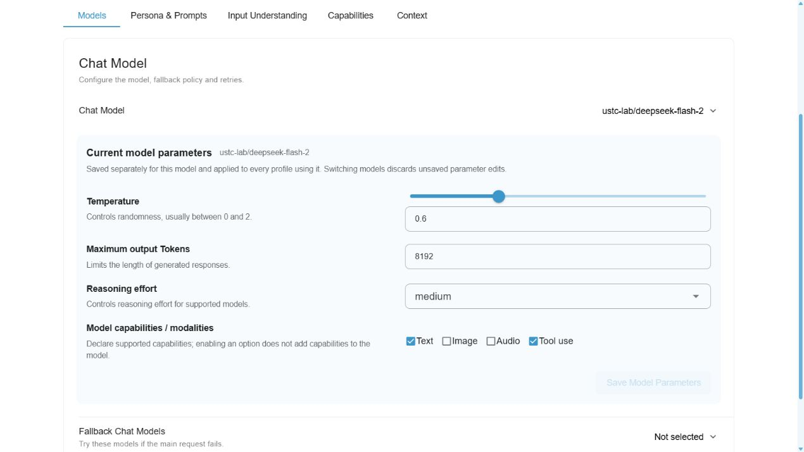
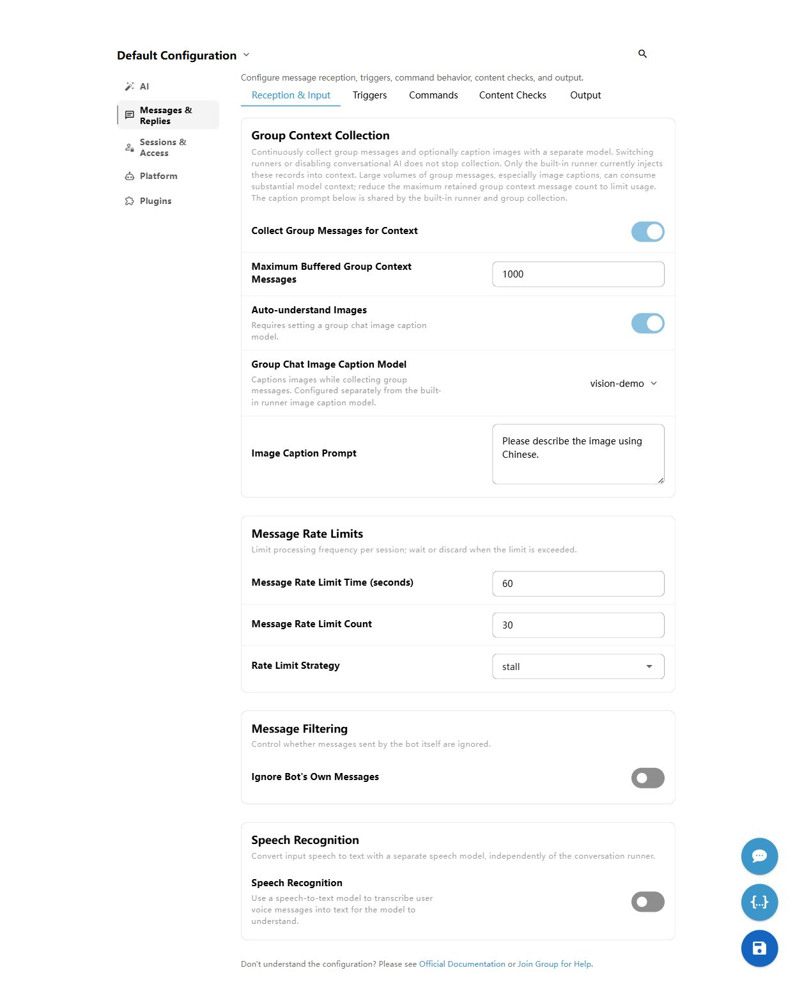
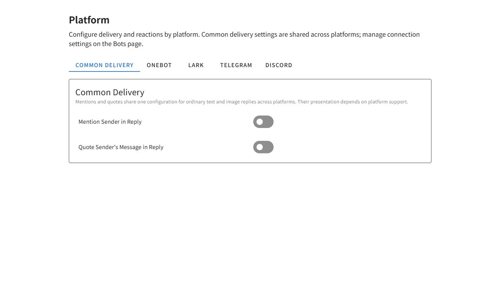
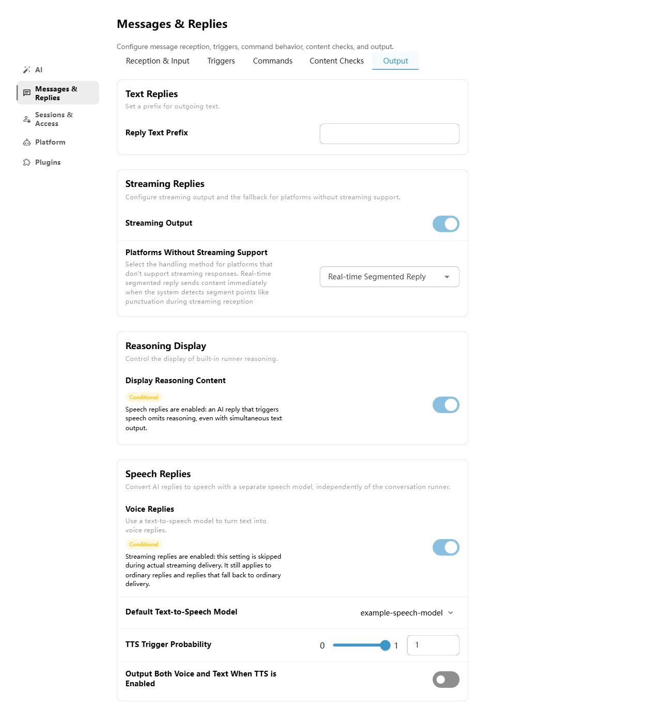

# WebUI

The AstrBot admin panel features plugin management, log viewing, visual configuration, statistics viewing, and more.

## Navigation and Previous Entry Points

These paths use the current default sidebar. If you customized it, open `System Settings → Appearance → Customize Sidebar` at the bottom of the sidebar to review or reset the layout.

The customization dialog has two sections: `System / Extensions`. Drag to reorder modules; drag across sections or use the arrows to move built-in modules. Select `Save` to apply changes immediately; settings are stored in the current browser only. Select `Reset to Default` to restore default membership and order.

Saved layouts migrate automatically: `Main Modules` entries are assigned to `System` or `Extensions` by purpose, and `More Features` merges into `Extensions`.

| Previous entry point or name | Current entry point |
| --- | --- |
| Providers → Add Provider → Agent Runner | Config → Select a profile → AI → top-right ⋯ → Switch Runner |
| Data / Dashboard | Data & Logs → Statistics |
| Conversation Management / Conversations | Data & Logs → Conversations |
| Logs / Console | Data & Logs → Logs |
| Trace | Data & Logs → Trace |
| Config → Normal Config | Config → Select a profile |
| Config → System Config | System Settings → General, Appearance, Network, or Security, depending on the setting |
| Commands / Command Management | Extensions → Handlers → Command |
| Standalone MCP / Skills entries | Extensions → MCP Servers / Skills |
| Custom Rules / Future Tasks / SubAgents | Custom Rules is under the sidebar `System` group; Future Tasks and SubAgents are under the `Extensions` group |

Old log, trace, conversation, and statistics URLs still redirect to the corresponding tabs. Agent runners are now saved in each profile; they are no longer created as model providers. See [Agent Runners](./agent-runner.md) for the setup steps.

## Accessing the Admin Panel

After starting AstrBot, you can access the admin panel by visiting `http://localhost:6185` in your browser.

> [!TIP]
> - If you're deploying AstrBot on a cloud server, replace `localhost` with your server's IP address.

## Login

For first-time login, AstrBot generates a random initial password and prints it in startup logs. Please read the startup log line containing the WebUI credential and use that password to log in (username is usually `astrbot`).

## Two-Factor Authentication

AstrBot WebUI supports TOTP (Time-based One-Time Password) based two-factor authentication.

### Enabling Two-Factor Authentication

1. Open `System Settings → Security` at the bottom of the sidebar and find `WebUI Security`.
2. Toggle on "Enable WebUI TOTP"; a setup dialog with a QR code will appear.
3. Scan the QR code using any TOTP-compatible authenticator app (e.g., Google Authenticator, etc.).
4. Enter the 6-digit verification code generated by the authenticator app to complete the verification.
5. The system will generate recovery codes for logging in if the authenticator device is lost. Be sure to save them securely.

To replace the TOTP secret, you can do so in the TOTP management window, where you will need to verify the current TOTP code first.

### Recovery Codes

- Each recovery code can be used only once. After logging in with a recovery code, two-factor authentication will be automatically disabled, and you will need to set it up again.
- Recovery codes can be regenerated in the TOTP management window.
- If you lose the recovery codes, you will not be able to regain account access through normal means. You will need to manually edit `data/cmd_config.json`, set `dashboard.totp.enable` to `false`, and manually clear `dashboard.totp.secret` and `dashboard.totp.recovery_code_hash` to disable two-factor authentication.

### Security Related

- Once two-factor authentication is enabled, modifying TOTP-related configurations requires verifying the current TOTP code to prevent unauthorized changes.
- Changing the admin panel password will revoke all trusted devices.

## ChatUI

AstrBot includes a built-in ChatUI for talking to configured models directly in your browser.

ChatUI supports these common workflows:

- The sidebar initially loads the 30 most recent conversations. Scroll near the bottom to automatically load older conversations, with a progress bar while loading. Automatic requests pause after a failure; select **Retry** to continue.
  If the list does not fill the sidebar, more pages load automatically. Opening an older conversation by URL keeps its title and selected sidebar entry visible before its page loads.
- Create, rename, and delete conversations, and switch previous conversations from the sidebar.
- Select the config profile, model provider, and model on the chat page; if Provider session separation is enabled, you can also choose a model for the current session only.
- Send text, images, files, and voice input; uploaded attachments show previews and use file signature checks to help identify file types.
- View model thinking, tool-call status, knowledge-base or web-search references, and per-message token and latency statistics.
- Copy or regenerate existing replies, including regenerating with another model.
- Edit a user message and continue generation from that point, or start a thread from a specific excerpt.
- Switch between streaming/normal response modes and SSE/WebSocket transport modes.

> [!NOTE]
> To keep message delivery ordered, keep only one ChatUI page open for the same browser session. If you open chat in multiple tabs, the system may ask you to reconnect.

## Visual Configuration

Select `Config` in the sidebar, then choose the profile at the top. Settings have five sections:

- `AI`: the current runner's models, persona, input understanding, knowledge and tools, and context settings. Open the AI page’s top-right `⋯` menu and select `Switch Runner…` to connect an external application. See [Agent Runner](./agent-runner.md) for setup and supported settings.
- `Messages & Replies`: `Reception & Input`, `Triggers`, `Commands`, `Content Checks`, and `Output` tabs cover message filtering and rate limits, wake rules and proactive replies, built-in commands, safety checks, and reply formatting. Speech recognition is under `Reception & Input`; speech replies are under `Output`.
- `Sessions & Access`: administrators, session allowlists, permission feedback, session isolation, and persistent group history.
- `Platform`: `Common Delivery`, `OneBot`, `Lark`, `Telegram`, and `Discord` tabs cover mentions, quotes, forwarded messages, and reaction acknowledgements. Manage platform connections on the `Bots` page.
- `Plugins`: select the plugins enabled for this profile. Edit individual plugin parameters through the plugin's gear icon on the sidebar `Extensions` page.

The built-in runner’s `Context` tab manages context and sanitization. `Capabilities` manages tool execution, computer use, knowledge-base retrieval, web search, and scheduled-task tools.

After explicitly selecting a chat model under `AI → Models`, use `Current model parameters` below it to edit temperature, maximum output Tokens, reasoning effort, and capabilities / modalities. Parameter editing is unavailable with automatic model selection. `Save model parameters` immediately applies changes to every profile using that model. Search and tab changes retain unsaved drafts within the current profile; save before switching models or profiles, or leaving or reloading the page. Model selection, fallback policy, and other profile settings still require `Save Configuration`.

Unset parameters show presets without saving them just by viewing. Clear a number or reasoning effort to restore the provider default. Reasoning effort accepts model-specific values; token limits accept scientific notation (for example, `1e5` means `100000`). Providers that do not support custom request-body parameters disable these controls. Anthropic-compatible models require adaptive thinking to be enabled before editing reasoning effort. Full settings and fallback-model parameters are under `Providers → Chat → Configured models → Gear`.

In a profile's chat-model and fallback-model selection menus, click the small gear beside a model to open its full settings. Clicking the gear preserves the selection and fallback order; saving model settings immediately affects every profile using that model.

Use this mapping to find relocated settings:

| Previous configuration entry | New configuration entry |
| --- | --- |
| AI → Current Runner / AI heading ⋯ → Change Execution Mode | AI → top-right ⋯ → Switch Runner |
| AstrBot Built-in AI | AstrBot Built-in Runner |
| AI → Common Settings → speech recognition and replies | Messages & Replies → Reception & Input / Output |
| AI → Common Settings → image processing and quoted-content parsing | AI → Input Understanding |
| AI → Common Settings → AI Requests | Messages & Replies → Triggers / Commands |
| AI → Advanced | AI → Context / Capabilities |
| AI → Context & Execution → Tool Execution | AI → Capabilities → Tool Execution |
| AI → Context & Execution | AI → Context |
| Platform → administrators, allowlists, session isolation | Sessions & Access |
| Platform → wake rules, message filtering, rate limits, built-in commands | Messages & Replies → Triggers / Reception & Input / Commands |
| Platform → Content Safety, reply text prefix | Messages & Replies → Content Checks / Output |
| Ext. → segmented replies, text-to-image | Messages & Replies → Output |
| Ext. / AI → Context & Execution → Group Context | Messages & Replies → Reception & Input → Group Context Collection |
| AI → Input Understanding → image caption prompt / Messages & Replies → Reception & Input → Shared Image Captioning | Messages & Replies → Reception & Input → Group Context Collection → Image Caption Prompt |
| Ext. → proactive replies, persistent group history | Messages & Replies → Triggers / Sessions & Access → Sessions & History |
| AI → resource-management shortcuts | Corresponding sidebar entries for models, personas, knowledge bases, and subagents |
| Platform → Delivery mentions/quotes, forwarding threshold | Platform → Common Delivery / OneBot |
| Platform → Feedback reactions | Platform → respective platform tab |

**Reception & Input → Group Context Collection** independently controls group message collection and optional image captioning. Currently only the built-in runner uses these records. Disabling conversational AI or changing runners does not stop collection; turn off the collection switch to stop it. Proactive replies alone do not start collection. Persistent group history has a separate switch under **Sessions & Access → Sessions & History**.

**Group Context Collection → Image Caption Prompt**, directly below the group caption model, is shared by the built-in runner and group collection. Large volumes of collected messages, especially image captions, can consume substantial model context. Reduce the maximum retained group context message count to limit usage.

Settings appear directly in tabs, with related parameters shown according to feature switches and execution mode. Search follows the same rules. Hidden settings retain their saved values.

A `Conditional` badge means the current feature combination may affect when a setting applies. Read the explanation below the badge for the conditions. Parameters remain editable and are never automatically disabled or cleared.

After editing, click the disk icon labeled `Save Configuration` in the lower-right corner and check for a successful save message.

Use the `{}` icon labeled `Edit Configuration File` to edit the current profile as JSON. Select `Apply This Configuration` to stage the changes in the visual editor, close the editor, and then select `Save Configuration`.

### System Settings

Global settings are under `System Settings` at the bottom of the sidebar:

- `General`: timezone, external callback address, logs, and cache.
- `Appearance`: sidebar and theme.
- `Network`: HTTP proxy, Python package sources, and GitHub proxy. For the address to use when AstrBot runs in Docker, see [Deploy with Docker](/en/deploy/astrbot/docker.md).
- `Security`: WebUI HTTPS, login rate limits, and TOTP.
- `Maintenance`: backup, restore, and restart.
- `OpenAPI`: developer access keys.

System configuration changes save automatically. Check for a successful save message and restart AstrBot if the page indicates that a restart is required.

## Plugins

Select `Extensions` in the sidebar. The top tabs are `Plugins`, `Skills`, `MCP Servers`, and `Handlers`. Within `Plugins`, switch between `Installed` and `AstrBot Plugin Market` to view local and market plugins.

On either plugin list, you can also click `Install Plugin` (+) in the bottom right corner to manually install plugins via URL or file upload.

> Due to the plugin update mechanism, the AstrBot Team cannot fully guarantee the security of plugins in the plugin market. Please carefully verify them. The AstrBot Team is not responsible for any losses caused by plugins.

### Handling Plugin Load Failures

If a plugin fails to load, the admin panel will display the error message and provide a **"Reload"** button in the failed plugins list. This allows you to quickly reload the plugin after fixing the environment (e.g., installing missing dependencies) or modifying the code, without having to restart the entire application.

## Data & Logs {#data}

Select `Data & Logs` in the left sidebar to switch between `Statistics`, `Conversations`, `Logs`, and `Trace` from the tabs at the top of one workspace.

### Statistics

The `Statistics` tab summarizes platform instances, messages, model calls, tokens, and uptime. It also shows message trends, platform message rankings, model-call trends, model usage rankings, and conversation model usage rankings. Use the range selector at the top to view 1 day, 3 days, or 1 week.

### Conversations

Use the `Conversations` tab to find and manage saved conversation records:

- Filter by keyword, bot ID, private/group conversation type, or UMO, and sort by creation or update time.
- By default, the list loads 30 records per page from the server. When **Group by session** is enabled, pagination switches to UMO sessions and expanding a session reveals all of its conversations. Full message history is loaded only after you select a conversation and is then shown in the preview on the right.
- Edit titles, export multiple selected conversations, or delete multiple selected conversations.
- Use the `{}` button in the preview header to inspect the raw `history` JSON in a read-only, word-wrapped Monaco editor.
- Select `Back to legacy` in the upper-right corner if you still need the original table-based view.

### Logs

The `Logs` tab shows AstrBot runtime logs in real time. You can filter by log level and install missing Pip packages from this page. To view DEBUG logs, first set `Console Log Level` to `DEBUG` under `System Settings → General → Logs`.

### Trace

The `Trace` tab shows AstrBot execution traces in real time and is useful for debugging model-call paths and tool invocations. Use the switch at the top to enable or disable trace recording.

> [!NOTE]
> Trace recording currently covers only some model-call paths from the AstrBot main Agent. Coverage will continue to improve.

## Command Management

Use `Extensions → Handlers → Command` to centrally manage all registered commands; system plugins are hidden by default.

Filter by plugin, type (command / command group / subcommand), permission, and status, and combine with the search box for quick lookup. Command group rows can expand to show subcommands, badges display the subcommand count, and subcommand rows are indented to indicate hierarchy.

You can enable/disable and rename each command.

## Updating the Admin Panel

When AstrBot starts, it automatically checks if the admin panel needs updating. If it does, the first log entry (in yellow) will prompt you.

In the browser WebUI, open `⋮ → Update AstrBot` in the upper-right corner, expand `Advanced settings`, and click `Download and Update` under `Update Dashboard to Latest Version Only`. The page refreshes automatically after a successful update. In the desktop app, the update entry opens the desktop application updater.

You can also use the `/dashboard_update` command to manually update the admin panel (admin command).

Admin panel files are located in the data/dist directory. If you need to manually replace them, download `dist.zip` from https://github.com/AstrBotDevs/AstrBot/releases/ and extract it to the data directory.

## Customizing WebUI Port

Modify the `port` in the `dashboard` configuration in the data/cmd_config.json file.

## Forgot Password

Modify the `password` in the `dashboard` configuration in the data/cmd_config.json file and delete the entire password key-value pair.

> [!TIP]
> For more details, see [FAQ - Forgot Dashboard Password](/en/faq.md#forgot-dashboard-password).
