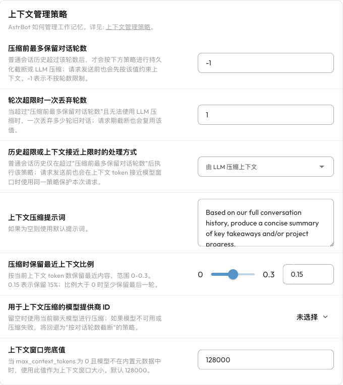

# 上下文压缩

对话越长，AstrBot 发送给模型的历史消息、工具调用结果等内容就越多。这些内容构成模型的「上下文」，会占用模型的上下文窗口，也会增加请求的 Token 用量。

上下文压缩用于在长对话中减少旧内容：可以删除较早的对话，也可以先让模型把旧内容总结成摘要，再继续对话。它适用于 **AstrBot 内置 AI**；使用 Dify、Coze 等第三方执行方式时，由对应平台管理上下文。

> [!NOTE]
> 压缩有助于继续长对话，但不能保证完整保留每个细节。需要长期保存的资料应放入[知识库](./knowledge-base.md)或文件，不要只依赖聊天记录。

## 快速配置

1. 打开 WebUI 左侧「配置文件」，选择机器人正在使用的配置文件。
2. 进入「AI → 高级 → 上下文管理策略」。如果看不到这组设置，请确认当前使用的是 AstrBot 内置 AI，并已开启「启用 AI」。执行方式的切换见 [Agent 执行方式](./agent-runner.md)。
3. 在「历史超限或上下文接近上限时的处理方式」中选择策略。新配置文件默认使用「由 LLM 压缩上下文」。
4. 初次配置时，可以保留最近上下文比例 `0.15`，让压缩模型留空以使用当前聊天模型；「压缩前最多保留对话轮数」保持 `-1`，避免额外按轮数截断历史。
5. 点击右下角「保存配置」。

这些设置按配置文件生效。多个机器人使用不同配置文件时，需要分别检查。

## 两种处理方式 {#压缩策略}

| 处理方式 | 怎么处理旧内容 | 适合的情况 |
| --- | --- | --- |
| 按对话轮数截断 | 删除较早的对话，不生成摘要 | 更重视低延迟、低成本，旧话题不需要继续引用 |
| 由 LLM 压缩上下文 | 调用模型总结旧内容，并保留一部分最近的原始上下文 | 长时间讨论同一主题，或 Agent 需要继续尚未完成的任务 |

LLM 压缩会额外调用模型，因此会增加一次请求的时间和费用。摘要可能遗漏细节；截断则会直接丢失被移除的内容。

### LLM 压缩设置

| 设置 | 含义与建议 |
| --- | --- |
| 用于上下文压缩的模型提供商 ID | 留空使用当前会话的聊天模型。也可以选择一个已配置的对话模型；它需要能处理待总结的长上下文。 |
| 压缩时保留最近上下文比例 | 默认 `0.15`，表示以当前上下文 Token 数的 15% 为预算保留最近的原始内容，范围为 `0–0.3`。按完整对话轮次保留，不会精确切到某个 Token；比例大于 0 时至少保留最后一轮。 |
| 上下文压缩提示词 | 留空使用默认提示词。需要定制摘要时，可以要求保留任务目标、已完成的步骤、关键结论、文件路径和下一步计划。 |

默认摘要会关注用户目标、任务进度、关键结论、工具结果以及读过的资料，方便继续后续工作。如果压缩模型不可用，AstrBot 会尝试使用当前聊天模型；如果无法生成摘要，则回退为截断旧对话。

## 什么情况下会处理上下文

### 1. 请求接近模型上下文窗口上限

AstrBot 会在**每次向模型发送请求之前**检查上下文，包括 Agent 调用工具后再次请求模型的步骤。当上下文 Token 用量超过模型窗口的约 **82%** 时，会触发所选处理方式。

处理后会再次检查。如果仍然过长，AstrBot 会从最旧的完整对话轮次开始移除内容，并保留最后一轮。工具调用与对应结果会一起处理，避免只剩下一半的调用记录。

如果最新一轮本身就过大，自动压缩仍可能无法使请求符合模型限制。此时需要减少单次输入或工具返回内容，或者使用上下文窗口更大的模型。

### 2. 达到设置的对话轮数限制

「压缩前最多保留对话轮数」是额外的历史长度限制，默认 `-1` 表示不按轮数限制。设置为正数后，请求发送前也会先按这个限制截断较早的内容，再检查 Token 用量；「轮次超限时一次丢弃轮数」控制一次移除多少轮，默认 `1`。

如果希望模型尽量总结旧信息，而不是较早按轮数丢弃它们，可以保留 `-1` 并使用 LLM 压缩。`-1` 不会关闭基于 Token 的自动压缩。

## 正确设置模型上下文窗口 {#️-重要-模型上下文窗口设置}

压缩判断依赖实际聊天模型的上下文窗口大小。窗口配置过大，可能导致模型先报超限；过小则会过早压缩。

1. 打开「模型提供商 → 对话」。
2. 在左侧选择模型所属的提供商，编辑右侧已添加的模型配置。
3. 将「模型上下文窗口大小」（`max_context_tokens`）设为提供商公布的窗口大小，并保存。

更多模型配置方法见[对话模型](../providers/llm.md)。

当 `max_context_tokens` 为 `0` 时，AstrBot 会尝试根据模型 ID，从内置的 [MODELS.DEV](https://models.dev/) 元数据中获取窗口大小。如果无法识别，则使用「上下文窗口兜底值」，默认 `128000`。因此，设为 `0` 并不等于关闭压缩，也不保证 AstrBot 能识别所有自定义模型名称。

对未识别的模型，最好填写准确的 `max_context_tokens`，而不是依赖默认兜底值。

## 常见问题

### 压缩之后为什么忘记了早期细节？

摘要不会逐字保留所有历史，截断更会直接删除旧内容。可以在提示词中明确要求保留重要信息，适当提高最近上下文比例，或把长期资料放入知识库。提高比例会减少可释放的上下文空间。

### 为什么没有触发压缩？

先确认修改的是当前会话使用的配置文件，并已保存。上下文没有超过约 82% 的窗口大小时，通常不会触发 Token 压缩；窗口大小填得过大也会延后触发。

### 明明开了压缩，为什么仍然报上下文超限？

检查聊天模型和压缩模型的窗口大小是否准确。单次长消息、大文件或工具返回的内容可能使最新一轮独自超限，自动压缩不会无限删去当前任务。减少本次输入规模后重试。

### 想从头开始一段对话怎么办？

在聊天中使用 `/reset` 清空当前对话上下文，或使用 `/new` 创建新对话。指令及唤醒前缀说明见[内置指令](./command.md)。
