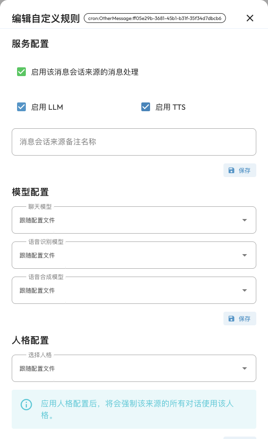

# 自定义规则

自定义规则用于给**某个具体会话**设置例外，而不必为每个群聊或私聊复制一份配置文件。例如：

- 工作群使用专业的人格和指定聊天模型，其他会话继续使用默认设置。
- 某个群只响应插件指令，不自动生成 AI 回复。
- 某个私聊关闭语音回复，或限制使用部分插件。
- 为一个会话选择特定的知识库。

这些规则优先于会话所属配置文件中对应的设置。没有单独指定的项目仍使用原来的设置；自定义规则不会创建新的模型、人格、插件或知识库，需要先在相应页面准备好它们。

## 先确认消息会话来源（UMO）

UMO（Unified Message Origin，统一消息来源）标识某个平台实例下的具体会话。自定义规则绑定的是 **UMO**，不是用户昵称，也不是当前对话的标题。

在需要配置的群聊或私聊中发送 `/sid`，查看返回的 UMO，再与 WebUI 中的会话来源核对。平台、群聊和私聊可能有相似名称，使用 UMO 能避免改错会话。指令及唤醒前缀说明见[内置指令](./command.md)。

> [!NOTE]
> 群聊是否按成员隔离对话，会影响会话划分。请以目标消息实际返回的 UMO 为准。为同一会话新建对话，不等于移除该 UMO 的自定义规则。

## 添加第一条规则

1. 先在目标群聊或私聊中与机器人进行一次对话，让 AstrBot 记录这个消息来源。
2. 打开 WebUI 左侧「自定义规则」（`/session-management`）。
3. 点击「添加规则」，在「选择会话」中选择目标来源，再点击「下一步」。已有规则的会话直接点击列表中的编辑按钮。
4. 在「编辑自定义规则」窗口中修改需要的设置，例如在「模型配置」选择聊天模型。
5. 点击**该设置区域下方的「保存」**。窗口中的服务、模型、人格、插件和知识库分别保存；修改多个区域时，请逐一保存。
6. 回到目标会话发送消息，确认规则效果。

规则保存后即生效，不需要重启 AstrBot。旧版本文档中的「会话管理」以及「更多功能 → 自定义规则」入口，对应当前左侧的「自定义规则」；页面地址仍为 `/session-management`。

## 可以设置什么

| 区域 | 设置 | 用途 |
| --- | --- | --- |
| 服务配置 | 启用该消息会话来源的消息处理 | 关闭后停止处理这个来源的消息，包含正常的 AI 回复和插件响应。恢复时应在 WebUI 重新开启。 |
| 服务配置 | 启用 LLM | 关闭后停止该会话的常规 AI 对话处理；插件指令仍可使用，具体插件自身的行为由插件决定。 |
| 服务配置 | 启用 TTS | 控制该会话是否使用语音合成输出；仍需先配置语音合成模型及相关全局功能。 |
| 服务配置 | 消息会话来源备注名称 | 为会话添加便于识别的备注，不会改变 UMO。 |
| 模型配置 | 聊天模型、语音识别模型、语音合成模型 | 为会话选择已经添加的模型，或选择「跟随配置文件」。 |
| 人格配置 | 选择人格 | 对这个会话强制使用指定人格；不选择则取消这项强制规则。 |
| 插件配置 | 禁用的插件 | 选择只在当前会话中禁用的插件，其他会话不受影响。 |
| 知识库配置 | 选择知识库、返回结果数量 | 使用指定知识库和检索结果数量，覆盖当前配置文件的对应设置。 |

服务开关用于控制该会话能否使用已配置的功能。单独勾选 LLM 或 TTS，不会替你开启配置文件中关闭的功能，也不会自动配置模型。

人格、插件和知识库的基础设置分别见 [WebUI](./webui.md)、[插件](./plugin.md)和[知识库](./knowledge-base.md)。

## 自定义规则与配置文件的区别

**配置文件**适合设置一组完整的机器人行为，例如模型、唤醒方式、消息处理和工具能力。**自定义规则**适合对其中少数会话做局部调整。

例如，两个群都使用 `default` 配置文件，但你只希望群 A 使用另一个聊天模型。可以只给群 A 添加模型规则，群 B 不受影响。之后修改 `default` 的聊天模型时，群 A 的指定模型仍然优先，直到你删除这条规则或选择「跟随配置文件」。

规则也不能使已经全局停用的插件重新加载。需要先在「插件」页面启用插件，再用自定义规则决定在哪些会话中禁用它。

## 修改和恢复默认设置

在列表中搜索会话来源或备注，点击编辑按钮继续修改。每个区域都有自己的保存按钮。

- **模型**：选择「跟随配置文件」并保存，移除对应的模型覆盖。
- **人格**：清空人格选择并保存，移除强制人格规则，恢复正常的人格选择逻辑。
- **插件**：从禁用列表中移除插件并保存；清空列表可取消该会话的插件禁用规则。
- **知识库**：清空知识库选择并保存，会移除会话级知识库规则，恢复配置文件的知识库设置。**这不表示关闭知识库。**
- **整个会话**：点击列表中的删除按钮，确认后删除该 UMO 的所有自定义规则，恢复原有设置。

删除自定义规则不会删除模型、插件、知识库或聊天记录。

## 批量操作和分组

需要调整多个会话时，可以使用页面下方的「批量操作」：

1. 在规则列表勾选会话，或在「应用范围」中选择全部会话、所有群聊、所有私聊或自定义分组。
2. 选择要修改的 LLM、TTS 状态或聊天模型。
3. 点击「应用更改」，然后检查目标会话的规则。

批量操作只修改选中的项目。首次使用建议先对少量已选会话操作，再扩展范围。

「分组管理」可以把相关会话整理到一个命名分组中，再以该分组作为批量操作范围。分组本身不会让成员自动继承同一套规则；加入分组后仍需执行批量修改。

## 常见问题

### 添加规则时找不到会话

先让目标会话与机器人进行一次对话，再点击「刷新」或重新打开「添加规则」。已有规则的来源不会再次出现在添加列表中，请从主列表编辑。

### 换了配置文件，怎么仍然使用旧模型或人格？

检查这个 UMO 是否有自定义规则。会话级指定仍优先生效；选择「跟随配置文件」、清空人格或删除规则后再测试。

### 已经关闭消息处理，机器人不响应恢复指令怎么办？

关闭消息处理会阻止该来源的消息进入后续处理流程。请在 WebUI 的「自定义规则」中重新开启，不要依赖在被停用的会话里发送指令来恢复。

### 保存后没有变化

核对目标 UMO、修改区域的保存结果，以及选择的模型、插件、人格或知识库是否可用。对比时使用新消息测试；自定义规则不会改写已经生成的回复。
