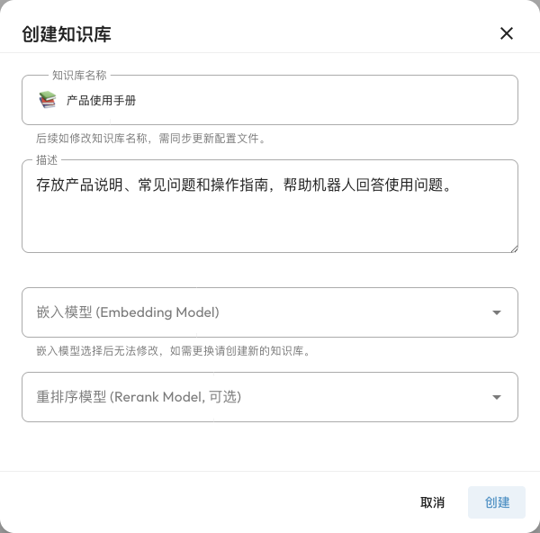
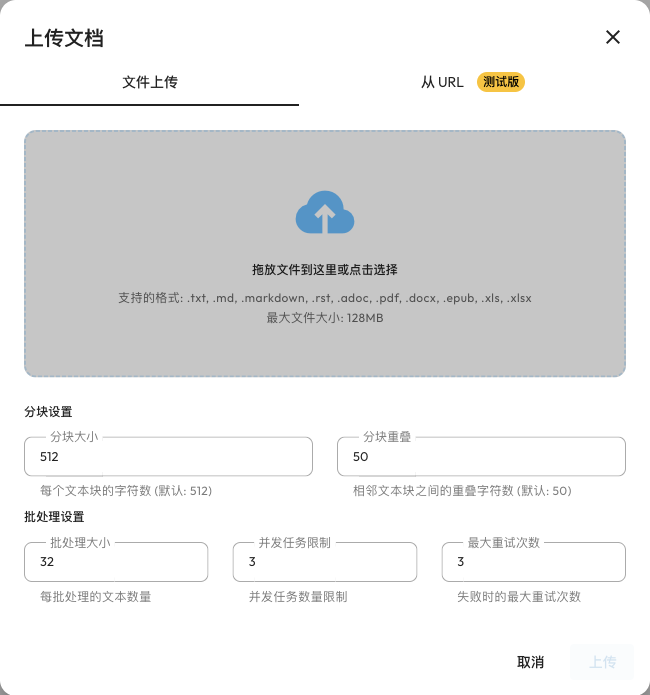

# AstrBot 知识库

知识库让 AstrBot 根据你提供的资料回答问题。把产品手册、常见问题、课程笔记或项目文档上传到知识库后，Agent 可以检索与问题相关的内容，再结合这些资料生成回答。

例如，上传一份“社群新人指南”，就可以让机器人回答“如何申请加入项目”“在哪里反馈问题”，而不必把整份文档写进人格提示词。

这属于检索增强生成（RAG）：上传时提取文本、切分为小段并建立索引；聊天时找到相关片段，再交给对话模型。上传资料不会训练或微调对话模型，答案也不保证完全正确。

## 先了解三个模型的分工

| 模型 | 是否必需 | 用途 |
| --- | --- | --- |
| 对话模型 | 回答问题时必需 | 阅读检索结果，生成自然语言回答 |
| 嵌入模型（Embedding） | 创建知识库时必需 | 把资料和问题转换为向量，用于查找语义相关内容 |
| 重排序模型（Rerank） | 可选 | 对候选片段重新评分，把更相关的内容排在前面 |

嵌入模型与对话模型分别配置，不能直接把一个只支持聊天的模型填入嵌入模型字段。第一次使用时，先准备一个对话模型和一个嵌入模型即可。

本页介绍 AstrBot 当前内置的知识库功能（4.5.0 起提供），不需要安装知识库插件。旧插件版的使用方法见 [旧版知识库文档](./knowledge-base-old.md)。

## 第一步：配置嵌入模型 {#配置嵌入模型}

1. 打开侧边栏的 `模型提供商`。
2. 切换到 `嵌入` 标签，点击 `新增`，选择提供商。
3. 填写该服务要求的 API 地址、API Key、模型名称和向量维度等信息。
4. 保存配置，确保该提供商可用。

当前可接入 OpenAI 兼容服务、Google Gemini、Ollama、阿里云百炼和 NVIDIA 等嵌入服务。以 `OpenAI Embedding` 为例：API 地址应填写服务的 API 基础地址，模型名称填写服务提供的嵌入模型，而不是对话模型。

如使用 Ollama 等本地服务，API 地址必须能从运行 AstrBot 的环境访问到。在 Docker 中填写 `localhost` 指向 AstrBot 容器本身，并不自动指向宿主机。

向量维度要与模型实际输出一致。不同模型的向量不能混用；不确定时，查阅提供商的模型说明。

### 配置重排序模型（可选） {#配置重排序模型-可选}

如果想使用重排序，在 `模型提供商 → 重排序` 中另行新增对应服务并保存。没有重排序模型也可以创建、上传和使用知识库。

::: tip 资料会发到哪里？
使用远程嵌入服务时，待建立索引的文本和检索问题会发送给该服务；回答时，检索出的相关内容会发送给对话模型。请根据资料要求选择合适的模型服务。
:::

## 第二步：创建知识库 {#创建知识库}

1. 打开侧边栏的 `知识库`，点击 `创建知识库`。
2. 填写一个容易识别的名称，例如“社群新人指南”，并补充描述。
3. 在 `嵌入模型` 中选择刚配置的提供商。
4. 如已配置重排序，可在 `重排序模型（可选）` 中选择它；否则留空。
5. 点击 `创建`。



可以创建多个知识库，例如分别存放产品手册和社群规则，之后按需选择一个或多个供聊天使用。

::: warning 更换嵌入模型需要重新建立知识库
知识库创建后，其嵌入模型选择不可修改。也不要直接修改被该知识库使用的提供商的模型或向量维度，这会使现有索引不兼容。需要更换模型时，新增模型提供商并创建新的知识库，重新上传原始资料。
:::

## 第三步：上传资料 {#上传文件}

### 从文件上传

1. 打开刚创建的知识库，进入 `文档管理`。
2. 点击 `上传文档`，保持在 `文件上传` 标签。
3. 选择或拖入文件，可以一次选择多个。
4. 第一次使用可以保留分块和批处理默认值，点击 `上传`。
5. 等待解析、分块和生成嵌入完成，确认文档列表显示了文档及分块数。



当前支持 `.txt`、`.md`、`.markdown`、`.rst`、`.adoc`、`.pdf`、`.docx`、`.epub`、`.xls` 和 `.xlsx`。上传界面标注单个文件最大为 128 MB；较大的资料建议按主题拆分，便于处理和维护。

PDF 应包含可提取的文本。只有扫描图片的 PDF 不会自动进行 OCR，建议先转成文字或可检索 PDF 再上传。排版复杂的表格或文档也可能影响解析效果，上传后可查看分块确认内容是否完整。

### 分块设置怎么选

分块就是把长文档拆成适合检索的小段。常用设置如下：

| 设置 | 作用 | 开始时建议 |
| --- | --- | --- |
| 分块大小 | 控制文本块的大小，按字符计算 | 使用默认值 512，再根据检索结果调整 |
| 分块重叠 | 保留相邻片段之间的一部分上下文 | 使用默认值 50，并小于分块大小 |
| 批处理大小 | 每批提交给嵌入服务的文本块数 | 使用默认值 32 |
| 并发任务限制 | 控制处理时的并发任务数 | 使用默认值 3；服务限流时适当降低 |
| 最大重试次数 | 失败任务的重试次数 | 使用默认值 3 |

修改知识库的默认分块设置会影响后续上传，不会自动把已上传的文档重新分块。需要调整已有资料时，应重新上传对应文档。

### 从网页 URL 导入

在上传窗口切换到 `从 URL`，输入公开网页地址。此功能当前为测试版，使用 **Tavily** 提取 HTML 网页内容；它读取的是 **默认配置文件**中的 Tavily Key。按界面提示配置 Key 后再导入，其他网页搜索提供商的 Key 不能代替它。

`启用内容清洗` 是可选项，会使用所选的对话模型清洗和整理提取的网页内容，产生额外的模型调用。需要登录、禁止爬虫或无法提取正文的页面可能导入失败。导入后的内容是当时的快照，网页更新不会自动同步到知识库。

## 第四步：先测试检索

上传成功不代表已经在聊天中启用。建议先在知识库详情的 `知识库检索` 标签中测试：

1. 输入一个文档确实包含答案的问题，例如“新人如何申请加入项目？”
2. 点击 `检索`，查看返回片段及其所属文档。
3. 确认片段中有答案，再把知识库接入聊天。

这一页测试的是检索结果，不是对话模型生成的回答。如果搜不到相关内容，应先检查文档和分块，而不是只修改人格提示词。

## 第五步：在聊天中使用 {#使用知识库}

1. 打开 `配置文件`，选择机器人或 ChatUI 实际使用的配置文件。
2. 在 `AI → 能力 → 知识库` 的 `知识库列表` 中选择一个或多个知识库。
3. 第一次使用可以保留检索结果数量的默认值。
4. 点击右下角的 `保存配置`。
5. 在对应会话中询问上传资料中的问题。

```text
请根据社群新人指南，说明申请加入项目的步骤。资料没有写到的部分请直接说明。
```

知识库不是永久加入模型的记忆。只有当前配置文件或会话选用了对应知识库，相关资料才会参与检索。不同配置文件可以使用不同知识库；不会因为在页面中创建了知识库，就自动对所有机器人启用。

### 普通检索与 Agentic 检索

| 模式 | 何时检索 | 对话模型要求 |
| --- | --- | --- |
| 普通检索（默认） | 根据当前消息进行检索，把相关片段附加到模型请求中 | 不要求知识库工具调用能力 |
| `Agentic 知识库检索` | 把知识库检索作为工具，模型自行决定何时、用什么问题检索 | 需要模型及其 API 支持工具调用 |

想让每次问答先检索资料，可以保留默认模式。开启 Agentic 后，并不保证每次回答都会查知识库；测试时可以明确要求“先查询知识库”。

### 检索数量如何调整

`融合检索结果数` 控制多个知识库结果融合后的候选数量，`最终返回结果数` 控制交给模型的片段数量。默认分别为 20 和 5。

数量过少可能漏掉答案；过多会增加模型输入和噪音。先从默认值开始，根据 `知识库检索` 返回的实际内容调整，不必追求最大数量。

### 为某个群或私聊单独选择

在 `自定义规则` 中，可以给指定消息来源设置知识库及检索数量。会话级选择优先于配置文件；在界面中清空选择并保存，会移除该覆盖规则，恢复使用配置文件中的知识库。操作方法见 [自定义规则](./custom-rules.md)。

## 维护知识库

- **查看资料**：在 `文档管理` 中点击文档的查看按钮，检查解析出的分块。
- **更新资料**：删除过时的文档后上传新版本，避免新旧规则同时被检索到。请保留原始文件备份。
- **调整检索**：在知识库的 `设置` 中调整稠密检索、稀疏检索数量，或选择重排序提供商。稠密检索侧重语义，稀疏检索侧重词语匹配。
- **修改名称**：配置文件按名称选择知识库，重命名后应同步检查并更新相关配置文件。
- **删除**：删除文档会删除它的分块，删除知识库会删除其中的文档和索引；这些操作不可恢复，执行前确认资料已有备份。

## 常见问题

### 创建或上传失败

先检查嵌入提供商是否已保存且可用，模型名称、API 地址和向量维度是否正确，Key 是否有额度，再查看 `数据与日志 → 日志` 的具体错误。遇到限流，可减少批处理大小或并发任务数。

### 已上传，但检索不到答案

打开文档检查分块：资料是否被成功解析？问题中的关键词是否出现？扫描 PDF 是否只有图片？然后在 `知识库检索` 中换一个更明确的问题测试。必要时调整分块、检索数量，或增加重排序模型。

### 检索测试有答案，但机器人没有用

检查聊天使用的配置文件是否已选中该知识库，有没有会话级规则覆盖；开启 Agentic 时，再检查模型及其 API 是否支持工具调用。模型仍可能忽略已提供的资料，可以在人格中补充“优先依据检索到的资料，资料不足时不要编造”的要求。

### 更换模型后报向量维度错误

原索引与新嵌入模型不兼容。恢复原提供商配置，或用新模型创建知识库并重新上传资料。仅把维度字段改成另一个数字无法转换已有向量。

## 示例：接入硅基流动嵌入服务 {#附录-高性价比的嵌入模型申请}

<span id="硅基流动"></span>

如使用 [硅基流动](https://cloud.siliconflow.cn/)，可在其控制台申请 Key，并在 AstrBot 新增 `OpenAI Embedding` 提供商：

- API Key：该平台申请的 Key。
- API 基础地址：`https://api.siliconflow.cn/v1`。
- 模型：平台当前支持的嵌入模型，例如 `BAAI/bge-m3`；维度按模型说明填写。

可用模型、价格和免费额度会变化，以平台当前说明为准。配置后，按照本页的创建、上传、检索测试步骤完成接入。

对于最新的公开信息，可以同时配置 [网页搜索](./websearch.md)；知识库更适合自己维护的资料，两者可以互补。
