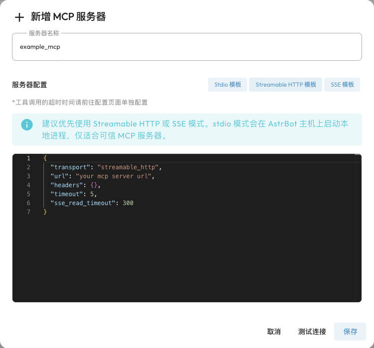

# MCP

MCP（Model Context Protocol，模型上下文协议）是一种连接 AI 应用与外部工具、数据服务的开放协议。可以把 MCP 服务器理解成一组能被 AI 调用的工具：服务器负责提供能力，AstrBot 负责连接服务器，把工具交给 Agent，并将调用结果用于回答问题。

例如，接入论文检索服务器后，用户可以说「帮我找最近关于 RAG 的论文」，Agent 就能调用检索工具；接入日历服务器后，可以让 Agent 查询日程。具体能做什么，取决于该服务器提供的工具及其账户权限。MCP 本身不会让模型自动获得所有网站或电脑的访问权限。

## 开始前需要什么

- 已配置好能正常聊天、支持工具调用的模型，并使用 AstrBot 内置 AI 执行方式。第三方 Agent 执行方式是否支持这些工具，取决于对应集成。
- 找到一个 MCP 服务器，并阅读它的说明，确认连接方式、配置内容、依赖和是否需要访问令牌。
- 确认服务器提供的是你需要的**工具**。当前这套接入流程主要用于把 MCP tools 提供给 AstrBot Agent。

MCP 与[插件](/use/plugin)和[技能 Skills](/use/skills)可以一起使用：插件扩展 AstrBot 的消息处理、指令等功能；MCP 接入独立服务的工具；Skills 为 Agent 提供可复用的任务流程。

## 选择连接方式 {#初始状态配置}

在 WebUI 打开 `插件 → MCP`。旧版文档中的独立工具页面入口，现在统一放在插件工作区的 MCP 标签页。

AstrBot 支持以下三种连接方式。**如果服务商提供远程地址，可以先使用 Streamable HTTP，无需为它额外安装 Node.js 或 uv。**

| 方式 | 适合什么情况 | 需要准备什么 |
| --- | --- | --- |
| Streamable HTTP | 连接服务商或自己部署的远程 MCP 服务 | MCP 地址、可选的认证请求头 |
| SSE | 连接使用旧版 SSE 传输的远程服务 | SSE 地址、可选的认证请求头 |
| stdio | 在 AstrBot 运行环境中启动 MCP 程序 | Python、uv、Node.js 等服务器要求的依赖 |

连接方式要与服务器说明一致。普通网页地址、REST API 地址不一定是 MCP 地址；也不要把 SSE 地址直接当作 Streamable HTTP 地址使用。

### stdio 的环境准备

**只安装你选择的服务器需要的依赖**：Python 类服务器可能使用 `uv` / `uvx`，Node.js 类服务器常用 `npx`。无需为了连接远程服务器同时安装它们。

依赖必须装在 **AstrBot 所在的运行环境**中。源码部署时，使用运行 AstrBot 的账户和环境；Docker 部署时，装在容器里，仅安装到宿主机不够。

当前仓库的官方 Docker 镜像构建包含 Node.js 和 uv。旧镜像或第三方镜像可能不同，可以先检查（将 `astrbot` 换成你的容器名称）：

```bash
docker exec astrbot uv --version
docker exec astrbot node --version
docker exec astrbot npx --version
```

缺少 uv 时，可以在 `数据与日志 → 日志` 中点击 `安装 pip 库` 安装 `uv`，或在容器中执行：

```bash
docker exec astrbot python -m pip install uv
```

缺少 Node.js 时，源码部署可参考 [Node.js 下载说明](https://nodejs.org/en/download)。Docker 部署建议更新到包含所需依赖的镜像，或把依赖写入自己的 Dockerfile；手动安装到容器里的程序可能在重建容器后丢失。

如果 AstrBot 找不到新安装的命令，重启 AstrBot 使其获取新的环境变量，或在 `command` 中填写可执行文件的绝对路径。Windows 路径在 JSON 中需要转义，例如 `C:\\tools\\node.exe`。

## 添加第一个 MCP 服务器 {#安装-mcp-服务器}

1. 打开 `插件 → MCP`，点击右下角的 **+**（新增服务器）。
2. 填写便于识别的**服务器名称**，例如 `arxiv`。
3. 选择对应模板，把服务器文档提供的 JSON 配置粘贴到**服务器配置**中，并替换地址、路径和令牌。
4. 点击**测试连接**，确认能连接并获取工具。
5. 点击**保存**。新增服务器时，AstrBot 会再次检查连接并连接服务器；返回列表后应显示**已连接**和可用工具。



这里建议一次添加一个服务器。如果服务文档给出带 `mcpServers` 外层的完整配置，可以取出其中一个服务器的配置对象粘贴。AstrBot 也兼容这种外层格式，但不会在一次新增操作中导入其中的所有服务器。

### 远程 Streamable HTTP 示例

下面是配置格式示例，`example.com` 是占位地址，不能直接用于测试。以服务商实际给出的地址和认证方式为准：

```json
{
  "transport": "streamable_http",
  "url": "https://example.com/mcp",
  "headers": {
    "Authorization": "Bearer YOUR_TOKEN"
  },
  "timeout": 30,
  "sse_read_timeout": 300
}
```

无需认证时，可以删除 `headers` 或改为 `{}`。使用 SSE 的服务器应把 `transport` 改为 `sse`，并填写它提供的 SSE 地址。

### stdio 示例：论文检索 {#一个例子}

以 [arxiv-mcp-server](https://github.com/blazickjp/arxiv-mcp-server) 为例，其服务说明使用 uv 启动：

```json
{
  "command": "uv",
  "args": [
    "tool",
    "run",
    "arxiv-mcp-server",
    "--storage-path",
    "data/arxiv"
  ]
}
```

首次启动可能需要下载依赖，具体参数以服务器最新 README 为准。Docker 部署时，下载论文等持久文件建议写到已挂载的 `data` 目录中；填写的是容器内路径。

如果服务器需要环境变量，直接使用 JSON 的 `env` 对象。下面是格式示例，命令、包名和变量名需替换为服务器要求的内容：

```json
{
  "command": "uvx",
  "args": ["your-mcp-package"],
  "env": {
    "API_TOKEN": "YOUR_TOKEN",
    "API_URL": "https://example.com"
  }
}
```

`command` 是启动程序，`args` 是分别传入的参数，不是一整行 Shell 命令。当前版本会校验 stdio 启动命令，不支持旧文档中的 `command: "env"`，也不支持 `bash -c` 等 Shell 包装；请用 `env` 字段传递环境变量。

> [!NOTE]
> stdio 服务器会在 AstrBot 运行环境中启动本地进程。请使用可信的服务器，并按需要设置它的访问权限。Agent 的本机隔离设置不会自动把这个 MCP 服务进程放进隔离环境。

## 让 Agent 使用 MCP 工具

连接成功后，还需要确保工具能提供给当前对话：

1. 打开 `人格设定`，编辑当前对话使用的人格。
2. 在**人格能力**中的工具列表找到该 MCP 服务器。可以按服务器整体选择，也可以点击齿轮选择具体工具，然后保存人格。
3. 确认对话使用了这个人格，再用自然语言描述任务，例如「检索最近关于多模态 RAG 的论文，给我标题和链接」。

默认人格使用全部可用能力；需要限制工具范围时，请创建或编辑自定义人格。如果工具已在全局管理中停用，仅在人格中选择它不会重新启用工具。

**已连接只代表服务可达，不代表模型一定会调用工具。** 是否调用取决于模型的工具调用能力、当前人格、用户任务和工具说明。MCP 查询等外部工具不要求你开启「使用电脑能力」；只有需要 AstrBot 自己执行代码或操作文件时，才需要配置[运行环境和权限](/use/astrbot-agent-sandbox)。

## 管理和同步服务器

- **查看工具**：点击列表中的可用工具数量，查看该服务器当前提供的工具名称。
- **修改配置**：点击服务器条目，修改 JSON 后保存。
- **连接 / 断开**：用条目右侧的开关控制连接。断开后，该服务器的工具不再可用。
- **删除**：使用删除按钮移除 AstrBot 中的服务器配置。删除配置不会替你卸载 stdio 程序或删除远程服务。
- **从 ModelScope 同步**：点击右下角的同步按钮，按弹窗说明从 ModelScope 获取个人访问令牌并同步服务器。请先在该平台配置好需要的 MCP 服务。

## 常见问题

| 现象 | 先检查什么 |
| --- | --- |
| JSON 格式错误 | 是否有缺少的引号、尾随逗号，或把说明文字也粘贴进了配置 |
| 找不到 `uv`、`npx`、`node` | 命令是否在 AstrBot 的环境中可用；Docker 用户应检查容器内，而非宿主机 |
| stdio 命令不允许 | 不要把一整行 Shell 命令放入 `command`；用服务器支持的 Python/Node.js/uv 启动方式，环境变量写入 `env` |
| 远程服务返回 401 / 403 | 令牌是否正确、是否过期，以及 `headers` 是否符合服务商要求 |
| Docker 中无法连接 `localhost` | 容器内的 `localhost` 指容器自己。访问宿主机服务需使用容器可访问的地址；Docker Desktop 通常可使用 `host.docker.internal` |
| 已连接但没有工具 | 该服务是否提供 MCP tools，是否需要额外的账户权限；查看服务端日志和 AstrBot 的 `数据与日志 → 日志` |
| 有工具但 Agent 不调用 | 模型是否支持工具调用、人格是否选中工具、工具是否已启用；先给一个明确需要该工具的任务 |
| 工具调用超时 | 区分连接慢与工具执行慢。连接参数在 MCP JSON 中；工具执行的「工具调用超时时间(秒)」可在配置文件中搜索并调整 |

不要把含真实令牌的配置、截图或日志直接分享给他人。排查时可保留字段名并隐藏值。

## 继续了解

- [MCP 官方文档](https://modelcontextprotocol.io/docs/getting-started/intro)
- [官方 MCP 服务器示例](https://github.com/modelcontextprotocol/servers)
- [awesome-mcp-servers](https://github.com/punkpeye/awesome-mcp-servers/blob/main/README-zh.md)
- [ModelScope MCP 广场](https://www.modelscope.cn/mcp)
