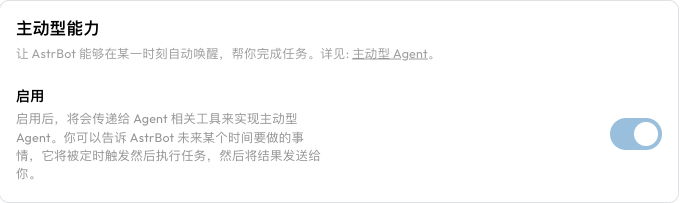
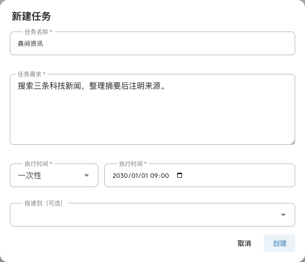

# 主动型能力

主动型能力让 AstrBot 在指定时间执行任务，而不必等用户再次发消息。例如：“十分钟后提醒我休息”，或“每天早上搜索科技新闻，整理后发到这个群”。定时触发后，Agent 会根据任务需求调用模型和工具，并尝试把结果发送到目标会话。

这不是一直运行的自主监控：需要先创建任务，并保持 AstrBot 运行。搜索、访问文件等能力仍需要分别配置。此功能在 v4.14.0 引入，目前仍属于**实验性功能**。

<span id="如何使用"></span>

## 先配置运行条件

1. 在 **配置文件**中选择目标会话使用的配置文件，进入 **AI**，开启 AI，并选择 **AstrBot 内置 AI**。
2. 确认对话模型能正常使用且支持工具调用。
3. 打开 **AI → 能力 → 主动型能力**，开启 **启用**，点击右下角 **保存配置**。这会提供 `future_task` 工具，供 Agent 通过聊天管理任务。
4. 在 **扩展功能 → 未来任务**（`/cron`）点击 **支持的消息平台**，确认准备接收结果的平台已配置且支持主动消息。



不同配置文件可以分别控制是否向聊天中的 Agent 提供定时任务工具。**关闭此配置不会删除或暂停已经创建的任务**；要停止已有任务，请到未来任务页面停用或删除它。

## 通过聊天创建任务 {#未来任务-futuretask}

<span id="功能特点"></span>

完成配置后，在希望接收结果的私聊或群聊中直接告诉 AstrBot：

```text
十分钟后提醒我休息一下，只提醒一次。
```

也可以创建循环任务：

```text
每天北京时间早上 9 点，搜索三条科技新闻，给出标题、简短摘要和来源链接，并发到这个群。
```

模型会调用 `future_task` 创建计划。不要只看它是否口头回复“好的”：打开未来任务页面，检查任务需求、执行时间、下次执行时间和投递地是否正确。新闻任务还需要先配置[网页搜索](./websearch.md)。

在聊天中还可以要求它：

- “列出我在这个会话设置的未来任务。”
- “把我的休息提醒改到明天下午三点。”
- “删除我刚才设置的新闻任务。”

聊天中的任务查询、修改和删除限定为**当前会话、当前发送者创建的任务**。群成员不能修改或删除别人创建的任务；从 WebUI 创建的任务也不能直接在聊天中当作自己的任务管理，管理员应使用 WebUI。

## 通过 WebUI 创建和管理

打开 **扩展功能 → 未来任务**（`/cron`），点击右上角 **新建**。无需先让模型替你创建任务。



| 字段 | 含义与示例 |
| --- | --- |
| 任务名称 | 用于识别任务，如“每日科技简报”。 |
| 任务需求 | 到时间后 Agent 实际执行的指令。说明信息来源、处理步骤、结果格式及是否需要发送给用户。 |
| 执行时间 | 选择一次性、间隔、每天、每周、每个月或自定义。 |
| 投递到（可选） | 选择接收结果的已有会话。留空也能执行任务，但不会自动把结果投递到某个用户或群。 |

如果投递列表为空，先在目标平台与 AstrBot 对话，再回到此页面选择会话。投递地以 UMO（统一消息来源）标识，包含平台、消息类型和会话标识。

任务列表会显示计划、投递地和下次执行时间，也支持搜索任务名称或内容、按投递地筛选。点击任务可编辑，卡片开关可停用计划，**更多操作**菜单提供 **立即执行**和**删除**。鼠标悬停在执行时间信息上可查看最近执行时间及错误（如有）。

- **停用**保留任务内容，只暂停按计划触发。
- **立即执行**会真实运行任务，可能调用收费模型、外部服务并发送消息。即使任务已停用，也可以手动执行。
- 手动立即执行一次性任务不会删除它，也不会替代原定执行时间；如果只是测试，测试后检查是否还需要保留计划。
- 一次性任务在正常定时触发后会删除，**执行失败也会删除**。循环任务保留并继续按计划触发。

## 执行时间和时区

新手建议使用“每天”“每周”等时间选择器。自定义计划采用五段 Cron 表达式，顺序为：

```text
分钟 小时 日 月 星期
```

| 表达式 | 含义 |
| --- | --- |
| `0 9 * * *` | 每天 09:00。 |
| `0 17 * * fri` | 每周五 17:00。 |
| `0 9 1 * *` | 每月 1 日 09:00。 |

循环计划使用任务的时区；WebUI 新建时默认从投递会话对应的配置文件取得时区，未指定时使用系统时区。一次性日期时间选择器使用浏览器本地时间并转换为绝对时间。服务器、容器和浏览器时区不同时，务必检查创建后的执行时间。

“间隔”目前转换为 Cron 日历字段步进，并不是“从创建时刻起每隔 N 小时”的计时器。例如，每隔 2 小时会在偶数整点执行。分钟、小时、天的步进上限分别为 59、23、31；跨月的天数步进不等于固定时长。每月选择 29、30、31 日时，没有该日期的月份不会执行。

AstrBot 必须在线才能执行任务。任务会保存，重启后重新加载计划，但不要依赖它补发停机期间错过的所有提醒。首次配置建议先用几分钟后的一次性任务检查时间和投递。

## 执行时会用到哪些能力

定时任务会使用目标会话对应的配置和对话上下文。修改模型、人设、工具配置后，后续任务可能受这些变更影响；任务需求中应写明必要信息，不要只写“按刚才说的做”。未选择投递地的任务使用独立的定时任务会话和默认配置。

任务不会自动获得额外能力：

- 需要最新信息，先配置[网页搜索](./websearch.md)。
- 需要读写文件或执行代码，先配置[Agent 沙盒环境](./astrbot-agent-sandbox.md)。
- 需要调用业务系统，先配置对应[插件](./plugin.md)或 [MCP](./mcp.md)。

### 支持的平台

任务触发和结果投递是两个环节。任务执行成功并不代表平台一定允许发消息；平台权限、会话标识、连接状态、主动消息窗口和媒体格式都会影响投递。以页面的 **支持的消息平台**和所接平台文档为准，不应把旧版固定平台列表当作完整支持范围。

## 多媒体消息的发送

<span id="功能特点-1"></span>

AstrBot 内置 `send_message_to_user` 工具，支持文本、图片、语音、视频、文件和提及用户。Agent 可用它直接发送已经生成或取得的内容，包括定时任务结果。

这个工具本身不生成图片或语音；生成内容需要相应模型或工具。文件还需要存在于 Agent 可访问的位置，具体媒体类型能否发送取决于平台。

## 验证与排查

先创建“几分钟后发送一句测试提醒”的一次性任务，检查它是否出现在列表、时间是否正确，并保持 AstrBot 在线直到收到结果。复杂任务先通过普通聊天验证，再放入计划。

| 问题 | 排查方式 |
| --- | --- |
| 只回复“已设置”，列表没有任务 | 检查对应配置文件是否启用主动型能力、模型是否支持工具调用，以及对话中是否实际调用了 `future_task`。 |
| 任务存在但时间不对 | 检查配置文件时区、服务器/容器时区和浏览器本地时间，核对创建后的下次执行时间。 |
| 到时间没有执行 | 检查任务是否启用、AstrBot 是否在线，以及模型和服务是否可用。在 **数据与日志 → 日志**搜索任务相关错误。 |
| 执行了但没有消息 | 检查投递地、支持的平台、平台连接和发送权限；未设置投递地不会自动回传结果。 |
| 搜索或文件操作失败 | 单独验证相应工具的配置、依赖和权限；主动型能力只负责定时唤醒。 |
| 一次性任务不见了 | 定时触发后无论成功失败都会删除，到日志中检查执行结果。 |
| 聊天里找不到某个已有任务 | 确认在原会话由同一个发送者查询；其他成员或 WebUI 创建的任务需要到 WebUI 管理。 |
