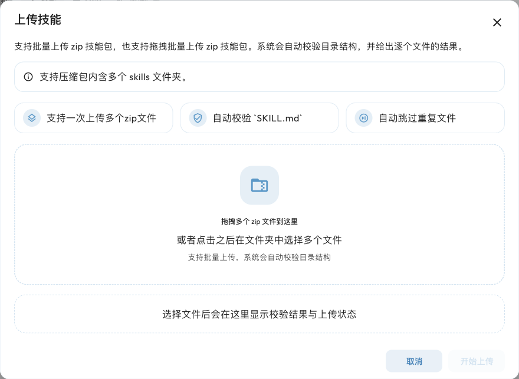

# 技能 Skills {#anthropic-skills}

Skill 是给 Agent 使用的「任务操作手册」。它把完成某类任务的步骤、规则、模板和参考资料放在一个文件夹中，核心文件是 `SKILL.md`，还可以附带脚本和示例。

例如，一个「周报整理」技能可以规定如何汇总事项、区分进展和阻塞、输出统一格式；一个「表格处理」技能可以说明怎样清洗数据并生成文件。用户只需描述任务，Agent 会根据技能的名称和描述判断是否适用，先读取说明，再按需使用相关资源。

AstrBot 从 v4.13.0 起支持这种 Agent Skills 形式。它并不限于 Claude 模型，但需要模型理解技能说明；涉及读取文件、调用工具或执行脚本时，还需要相应能力。

## Skills 与工具有什么区别 {#关键特性}

| 类型 | 提供什么 | 例子 |
| --- | --- | --- |
| 工具（Tool） | 一个具体操作接口 | 搜索网页、读取文件、执行 Python |
| [MCP](/use/mcp) | 接入外部服务提供的工具 | 查询日历、检索论文 |
| Skill | 完成任务的方法和资源 | 按团队模板整理周报、按规则分析表格 |
| [插件](/use/plugin) | 扩展 AstrBot 的功能 | 注册指令、处理消息，也可以提供工具和 Skills |

Skills 会先向 Agent 提供名称、描述和文件路径，详细内容按任务需要读取，不会一开始就把每个技能的全部文件塞进对话。**上传 Skill 不会自动安装它需要的软件，也不会增加权限。** 如果技能要求 Python 库、外部 API 或某个工具，需要另外配置。

## 上传第一个 Skill {#上传-skills-到-astrbot}

1. 准备一个可信来源的 `.zip` 技能包。
2. 在 WebUI 打开 `插件 → 技能`，点击右下角 **+**（上传技能）。旧版独立技能页面的入口已移到插件工作区。
3. 点击文件选择区域，或把 ZIP 文件拖进去。可以一次选择多个 ZIP。
4. 点击**开始上传**，查看每个文件的上传结果。成功后返回技能列表，确认技能已启用。



同名文件在上传队列中会被跳过；如果本地已存在同名技能，上传不会覆盖它。更新前可以先下载备份，再编辑本地文件，或者删除旧技能后重新上传。

### ZIP 应该怎么打包

建议压缩包包含一个或多个技能文件夹，每个技能文件夹直接包含 `SKILL.md`。文件名大小写请保持一致：

```text
skills.zip
├── weekly-report/
│   ├── SKILL.md
│   └── references/
│       └── report-template.md
└── table-analysis/
    ├── SKILL.md
    └── scripts/
        └── analyze.py
```

也支持把 `SKILL.md` 直接放在 ZIP 根目录。对于根目录技能包或只包含一个技能文件夹的技能包，WebUI 会使用 ZIP 文件名（去掉 `.zip`）作为安装标识；多技能包使用各技能文件夹名称。为避免混淆，单技能包的 ZIP 名与文件夹名建议一致，例如 `weekly-report.zip`。

技能标识建议使用英文字母、数字、点、下划线或短横线。不要额外包一层不包含 `SKILL.md` 的仓库目录，也不要上传一个改后缀为 ZIP 的其他文件。

### 一份最小的 SKILL.md

下面的例子演示技能描述和操作步骤。`description` 应说明**做什么、什么时候用**，方便 Agent 判断是否需要加载：

```markdown
---
name: weekly-report
description: 当用户需要把零散工作记录整理成周报时使用，按进展、阻塞和下周计划输出。
---

# 周报整理

1. 阅读用户提供的工作记录；缺少关键信息时先询问。
2. 分别整理已完成事项、进行中事项和阻塞。
3. 按「本周进展」「问题与风险」「下周计划」输出。
4. 保留日期、负责人和关键数据，不编造用户未提供的进展。
```

将它保存为 `weekly-report/SKILL.md`，压缩为 `weekly-report.zip` 即可上传。更完整的格式可参考 [Agent Skills 规范](https://agentskills.io/specification)和 [Claude Skills 文档](https://code.claude.com/docs/zh-CN/skills)。

## 配置运行环境和人格 {#在-astrbot-使用-skills}

### 先让 Agent 能读取技能

在 `配置文件 → AI → 能力 → 使用电脑能力` 中选择运行环境，然后保存配置：

- **本机环境（local）**：Agent 使用 AstrBot 所在环境的文件工具。普通成员和管理员分别受本地权限矩阵控制。只需阅读说明时，可以允许工作区文件访问而不开启代码执行；需要运行技能脚本时，还要允许执行代码，并安装脚本依赖。
- **第三方沙箱环境（sandbox）**：Agent 在独立环境中读取技能、运行脚本。先配置好沙箱连接，AstrBot 会尝试把本地及插件 Skills 同步到活动沙箱。
- **无（none）**：技能清单仍可能提供给模型，但没有电脑能力的文件/执行工具，不能保证它能读取完整说明，更不能运行技能脚本。需要实际使用技能时，建议配置前两种环境。

具体的文件范围、执行权限、联网条件和部署方法见[Agent 沙盒环境](/use/astrbot-agent-sandbox)。Skills 不会绕过这些限制，也不会因为上传而自动授予普通成员代码执行权限。

### 再选择当前人格可用的技能

1. 在 `人格设定` 中编辑当前对话使用的人格。
2. 在**人格能力**的技能列表中选择技能；插件提供的技能会按插件分组，可以点齿轮选择具体技能。
3. 保存人格，并确认对话使用它。默认人格使用全部可用能力；需要限定技能时，请使用自定义人格。
4. 在聊天中说「使用 weekly-report 技能，把以下记录整理成周报」，并提供工作记录。也可以直接描述符合技能用途的任务，让 Agent 判断是否使用。

技能被停用、所属插件被停用，或未被当前人格选中时，都可能无法使用。安装、全局启用、人格选择和运行权限是不同的设置，需要分别检查。

## 管理已有技能

在 `插件 → 技能` 列表中，可以搜索名称、描述和来源：

- **启用 / 停用**：右侧开关控制技能是否提供给 Agent。停用保留文件，可随时启用。
- **查看和编辑**：点击本地技能条目打开文件编辑器，阅读 `SKILL.md`、参考资料和脚本；可编辑的文本文件支持保存修改。
- **下载**：将本地技能导出为 ZIP，便于备份或迁移。
- **删除**：删除本地技能及其文件；也可以使用「选择」批量删除。
- **刷新**：手动修改文件后，用右下角刷新按钮更新列表。

插件提供的技能可以阅读，但不能在这里编辑、下载或删除，需要通过所属插件管理。沙箱预置技能不能在本地技能页面编辑、删除或切换启用状态。不要把来源限制误认为页面加载失败。

## Skill 来源与优先级 {#skill-来源与优先级}

AstrBot 会从以下位置发现 Skills。前几种可在技能管理页面中查看，工作区技能是当前请求的能力：

| 来源 | 位置或获取方式 | 管理方式 |
| --- | --- | --- |
| 本地 Skills | WebUI 上传，或 `data/skills/<skill_name>/SKILL.md` | 技能页面管理 |
| 插件内置 Skills | 插件自己的 `skills/` 目录 | 由所属插件管理；请求时还受当前配置文件的插件选择影响 |
| 沙箱预置 Skills | 沙箱中发现的技能 | 沙箱环境管理；至少启动一次沙箱会话后才会填充发现清单 |
| 工作区 Skills | 当前会话工作区的 `skills/<skill_name>/SKILL.md` | 目前仅在本机环境下按请求发现，不显示在全局技能列表 |

工作区路径通常为 `data/workspaces/<normalized_umo>/skills/<skill_name>/SKILL.md`，其中 UMO 对应会话标识，目录名经过规范化。工作区技能不会写入全局配置，也暂不自动同步到第三方沙箱。

同名时的请求优先级为：**工作区 > 本地 > 插件内置 > 仅在沙箱内存在的技能**。工作区技能的覆盖只对当前请求生效。

人格指定技能列表会筛选本地、插件和沙箱技能，**不会过滤工作区技能**；人格明确不使用任何技能时，工作区技能也会被禁用。如果本地 Skill 已同步进沙箱，AstrBot 将其视为同一个技能，并在沙箱请求中使用沙箱内的可读路径。

### Shipyard Neo 技能

运行环境为第三方沙箱、驱动器为 `shipyard_neo` 时，页面还提供**本地技能 / Neo 技能**切换。Neo 技能页面用于查看技能候选和发布记录，包括通过/拒绝评估、发布到 `Canary` 或 `Stable`、同步以及停用/回滚等操作。

这用于管理在 Neo 中积累的可复用技能版本，不是上传普通 ZIP 的必经步骤。初次使用可以先完成本地技能上传和执行；Neo 的连接配置见[第三方沙箱环境](/use/astrbot-agent-sandbox#third-party-sandbox-environment)。

## 常见问题

| 现象 | 排查方向 |
| --- | --- |
| 上传失败，找不到 `SKILL.md` | 检查 ZIP 是否有效，`SKILL.md` 是否直接位于根目录或技能目录内，是否多套了一层仓库目录 |
| 提示同名技能已存在 | 上传不会覆盖现有技能；先下载备份，再编辑或删除后重新上传 |
| 列表没有描述 | 检查 `SKILL.md` 开头的 YAML frontmatter 是否包含字符串类型的 `description` |
| Agent 没有使用技能 | 先明确提及技能名称，检查启用状态、当前人格，以及模型是否有读取文件的能力 |
| Agent 读到了说明，却运行不了脚本 | 检查运行环境、当前用户的执行权限、联网权限及依赖；技能本身不会安装依赖或提升权限 |
| 插件技能灰色或无法操作 | 检查所属插件是否启用；插件技能的文件由插件管理 |
| 沙箱没有预置技能列表 | 先启动一次沙箱会话，再刷新；预置技能来自沙箱发现缓存 |
| 编辑/删除按钮不可用 | 确认它是可管理的本地技能，而非插件技能或沙箱预置技能 |

技能可能包含脚本和外部服务调用。使用前阅读说明，确认所需权限和依赖，再给 Agent 一个小任务验证输出是否符合预期。
