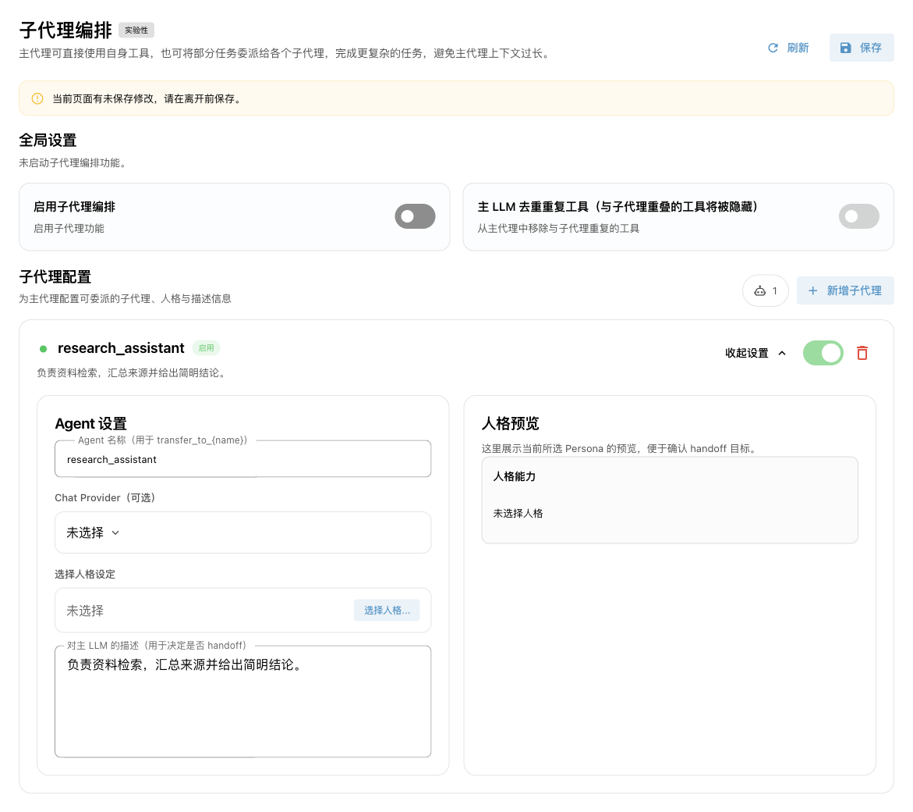

# SubAgent 编排 {#agent-handsoff-与-subagent}

SubAgent（子代理）是有明确分工的 AI 助手。主 Agent 负责与用户交流；遇到适合交给某个子代理的任务时，将任务交给它处理，再根据返回结果继续回答。

<span id="动机"></span>

例如，可以让一个子代理专门搜索资料，另一个专门整理文件。每个子代理使用各自的人格提示词和工具范围，也可以使用不同的对话模型。这样有助于区分职责、减少主 Agent 需要直接选择的工具，但也会增加模型调用和等待时间。对于只有少量工具的简单问答，通常不需要开启。

此功能在 v4.14.0 引入，目前仍标为**实验性功能**。本页介绍 AstrBot 内置 AI 的子代理编排；外部 AI 应用自己的编排功能由对应应用配置。

## 工作原理

1. 开启编排后，主 Agent 获得 `transfer_to_<名称>` 工具，例如 `transfer_to_research_assistant`，同时保留自己的工具。
2. 主 Agent 根据子代理的公开描述决定是否委派，并传入明确的任务内容；有需要时也可以传递图片。
3. 子代理使用绑定人格的提示词、预设对话和工具执行任务。
4. 子代理将结果返回给主 Agent，由主 Agent 整理并继续回答用户。

委派由模型决定，不是每条消息都触发，也不是固定的工作流。子代理接收的是委派任务和自身的预设对话，**不会自动收到主 Agent 的全部聊天历史**。需要的背景、文件路径、约束条件应包含在委派任务中。

委派工具也支持后台执行：主 Agent 可以先告知用户任务已提交，子代理完成后再唤醒主 Agent 处理结果。向聊天平台主动投递结果仍受平台能力限制，参见[主动型能力](./proactive-agent.md)。

## 创建第一个子代理 {#配置方法}

### 1. 准备模型和人格

先确认 AstrBot 内置 AI 能正常对话，且对话模型支持工具调用。在 WebUI 的 **扩展功能 → 人格设定**中创建一个专用人格，例如“资料研究助手”：

- 提示词说明如何收集资料、核实来源、组织结果。
- 工具只选择研究任务需要的工具，例如已经配置好的网页搜索或 MCP 工具。
- 如果只需要文本分析，可以不选择工具。

人格决定“这个助手如何工作”；子代理的公开描述决定“主 Agent 什么时候应该找它”。这两处内容用途不同。

<span id="_2-创建-subagent"></span>

### 2. 添加子代理

打开 **扩展功能 → 子代理编排**（`/subagent`），点击 **新增子代理**，再点击该子代理卡片的 **展开设置**。



| 设置 | 如何填写 |
| --- | --- |
| Agent 名称 | 如 `research_assistant`。必须以英文小写字母开头，只能包含小写字母、数字和下划线，最多 64 个字符，各子代理名称不能重复。 |
| Chat Provider（可选） | 指定子代理使用的对话模型；留空时使用当前会话解析出的对话模型。不是单独填写 API Key 的位置。 |
| 选择人格设定 | 选择刚创建的人格，右侧会展示人格预览。此项必填。 |
| 对主 LLM 的描述 | 写清适合委派的任务、需要提供的输入和期望结果。不要只写“一个很厉害的助手”。 |
| 启用开关 | 决定该子代理是否参与编排。新增子代理默认启用。 |

公开描述示例：

```text
负责查找和核实资料。需要比较方案、查找最新信息或汇总来源时，将问题和约束条件交给我。我会返回简明结论及来源链接。
```

工具范围在**人格设定**中维护，子代理页面没有独立的工具选择器。人格选择“全部工具”时，子代理可以使用当前可用的工具；选择具体工具时，仅使用仍存在且已启用的对应工具。使用电脑的工具还需要相应的运行环境和权限配置。

<span id="_1-启用-subagent-模式"></span>

### 3. 开启并保存

打开页面顶部的 **启用子代理编排**，点击右上角 **保存**。添加、修改、停用、删除子代理，以及修改两个全局开关，都需要保存才生效。保存后会重新加载编排配置，无需重启 AstrBot。

此页面管理的是**全局编排配置**，不是只对当前选中的配置文件设置子代理。

## 主 LLM 去重重复工具

默认情况下，主 Agent 可以直接使用自己的工具，也可以委派。打开 **主 LLM 去重重复工具（与子代理重叠的工具将被隐藏）**后，分配给启用子代理的重叠工具会从主 Agent 的工具列表移除。

例如，主 Agent 和研究子代理都有搜索工具：关闭去重时，主 Agent 可以自行搜索或委派；开启后，主 Agent 通过研究子代理完成对应搜索任务。

<span id="最佳实践"></span>

建议先关闭去重，确认子代理能够完成任务后再开启。不要给所有子代理都选择全部工具，否则很难形成清晰的职责边界。

## 如何确认它能正常工作

1. 先单独检查子代理需要的工具能否使用，例如网页搜索服务已经配置好、MCP 服务已连接。
2. 发起明确的请求，例如：“请交给资料研究助手，比较这两个方案，并给我来源链接。”
3. 在对话工具调用记录或 **数据与日志 → 日志**中检查是否出现 `transfer_to_research_assistant`，以及后续工具调用。
4. 检查最终结果是否符合人格要求，再逐步增加其他子代理。

模型仍可能决定直接回答；仅在页面创建子代理不能保证一定发生委派。

## 使用边界与常见问题 {#已知问题}

| 现象 | 排查方式 |
| --- | --- |
| 无法保存 | 检查名称格式、重复名称和是否选择了人格，包括已停用的子代理。 |
| 主 Agent 没有委派 | 确认全局开关、子代理开关和保存状态；使用支持工具调用的模型，并把公开描述写得具体。 |
| 子代理无法调用工具 | 检查人格的工具范围、插件/MCP 的启用状态，以及运行环境和权限。工具被停用后不会因为选入人格而重新可用。 |
| 子代理回答缺少背景 | 明确告诉主 Agent 应传递哪些资料和约束；子代理不自动继承完整聊天历史。 |
| 子代理模型报错 | 检查选中的 Chat Provider 是否存在、可用；留空可改用当前会话的模型。 |
| 调整人格后行为未更新 | 回到子代理页面保存，让编排重新加载人格内容。 |

子代理不是独立的容器或账号权限边界，它仍在当前会话的 AstrBot 环境中调用工具。文件与执行隔离应通过[Agent 沙盒环境](./astrbot-agent-sandbox.md)配置。

目前子代理的执行历史不会作为独立会话长期保存，也没有独立的 Skills 隔离配置。此页面不提供多级子代理委派配置，不应把它理解为可任意嵌套的 Agent 树。
