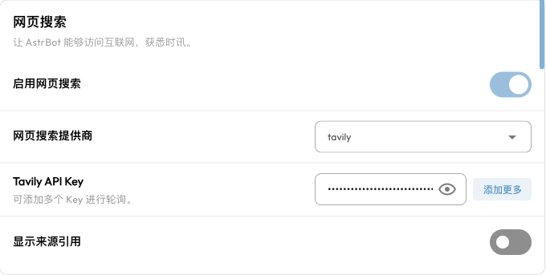

# 网页搜索

网页搜索让 AstrBot 内置 AI 在回答时调用搜索服务，获取新闻、产品更新、公开资料等信息。例如，让 Agent 查找某个软件的新版本、比较多个方案，或阅读一篇网页后总结要点。

模型会先获取搜索结果，再结合结果组织回答。搜索能补充模型已有知识，但结果仍可能过时或不准确；对于重要信息，建议打开来源核对。

## 开始前需要准备什么

- **使用 AstrBot 内置 AI**：在 `配置文件 → AI` 中启用 AI，执行方式选择 AstrBot 内置 AI。Dify、Coze 等第三方执行方式的搜索能力由对应服务配置。
- **支持工具调用的对话模型**：网页搜索通过函数调用（Function Calling / Tool Calling）运行。模型和接入它的 API 都需要支持工具调用。
- **搜索服务**：选择一个提供商，按需申请 API Key。搜索服务的 Key 与对话模型的 Key 是两回事。
- **网络连接**：AstrBot 所在的服务器或容器需要能访问所选服务的 API。

网页搜索是内置工具，不需要另外安装搜索插件，也不需要开启“使用电脑能力”。“允许执行代码时联网”的设置针对代码执行，不控制网页搜索服务的请求。

## 启用网页搜索

1. 打开侧边栏的 `配置文件`，选择聊天实际使用的配置文件。
2. 进入 `AI → 能力`，找到 `网页搜索`。
3. 打开 `启用网页搜索`，选择 `网页搜索提供商`。
4. 填写该提供商的 API Key。除百度 AI 搜索使用单个 Key 外，其余提供商的 Key 可以填写为列表；一个 Key 就可以开始，多 Key 可用于轮询。
5. 点击右下角的 `保存配置`。



这些设置属于当前配置文件。修改了 `default`，不代表使用其他配置文件的机器人会同时开启搜索。配置文件与消息平台的对应关系，可参见 [WebUI 使用指南](./webui.md)。

## 选择搜索提供商

当前支持以下七种接入方式。先选一个完成配置即可，无需同时申请所有服务。

| 提供商 | Key 申请入口 | AstrBot 提供的能力 |
| --- | --- | --- |
| <span id="tavily">Tavily</span> | [Tavily 控制台](https://app.tavily.com/home) | 网页搜索、按 URL 提取网页正文 |
| <span id="bocha">BoCha</span> | [博查](https://bochaai.com/) | 网页搜索 |
| <span id="百度-ai-搜索">百度 AI 搜索</span> | [百度智能云 API Key 管理](https://console.bce.baidu.com/iam/#/iam/apikey/list) | 百度 AI 搜索；需要开通相应服务 |
| <span id="brave">Brave</span> | [Brave Search API](https://brave.com/search/api/) | 网页搜索 |
| <span id="firecrawl">Firecrawl</span> | [Firecrawl](https://firecrawl.dev/) | 网页搜索、按 URL 提取网页正文 |
| <span id="exa">Exa</span> | [Exa 控制台](https://dashboard.exa.ai/) | 关键词或语义搜索、按 URL 获取正文，支持域名、日期等筛选 |
| <span id="anysearch">AnySearch</span> | [AnySearch 控制台](https://anysearch.com/console/api-keys) | 通用搜索，以及学术、代码文档、金融、法律等垂直领域检索 |

AnySearch 的 Key 留空时会使用匿名模式，服务提供每日免费额度。其他提供商需要填写相应的 Key。服务的额度、收费、可用地区和授权方式以各自官网为准。

### 搜索与读取链接的区别

“搜索某个话题”会从搜索服务获取结果；“总结这个链接”需要提取指定网页的正文。当前 Tavily、Firecrawl 和 Exa 都提供独立的网页正文提取工具。若经常需要阅读具体链接，优先选择其中一种。

网页提取不保证能读取所有网站。登录后才能访问的页面、反爬限制、付费内容，以及某些依赖脚本加载的页面，都可能导致提取失败。

## 如何在聊天中使用

保存配置后，向机器人或 ChatUI 发送带有明确搜索意图的问题，例如：

```text
请搜索 AstrBot 的最新发布信息，说明版本号和主要变化，并附上来源链接。
```

```text
请查找 bubblewrap 的官方使用文档，说明它适合解决什么问题。
```

如果选择了支持正文提取的提供商，还可以发送：

```text
请阅读这个网页并总结安装步骤：https://docs.astrbot.app/deploy/astrbot/docker.html
```

是否调用搜索、使用什么关键词，以及是否继续读取网页，由模型决定。打开开关不代表每条消息都会联网。如果希望本次回答依据最新信息，可以在问题中明确要求“先搜索再回答”。

ChatUI 可展示部分搜索工具返回的来源引用，实际呈现还取决于提供商、模型是否正确引用结果，以及使用的消息平台。在 QQ、Telegram 等平台上，可以直接要求模型附上来源链接。

## 常见问题

### 打开了开关，模型仍直接回答

先用“请先进行网页搜索，再回答……”测试，并检查：

1. 消息使用的是刚刚修改的配置文件，AI 执行方式为 AstrBot 内置 AI。
2. 对话模型及其 API 支持工具调用。
3. Key 已保存，搜索服务仍有可用额度。

### 提示 Key 无效、额度不足或请求失败

在 `数据与日志 → 日志` 中查看具体错误。`401`、`403` 常与 Key 或服务权限有关，`429` 常表示额度或频率限制；连接超时则应检查 AstrBot 所在环境到搜索 API 的网络连接。不要把对话模型的 Key 填入搜索服务的 Key 字段。

### 搜索正常，但链接总结失败

确认提供商支持网页正文提取，并尝试一个无需登录的公开网页。若只有特定网站失败，通常需要检查该网站的访问限制，而不是更换对话模型。

### 升级后原来的“默认搜索源”不再工作

旧配置中的 `default` 搜索源已不再支持。请在网页搜索配置中选择当前支持的提供商，填写对应 Key，并重新开启搜索后保存。

## 与其他能力配合

- [知识库](./knowledge-base.md)：回答你上传的手册、FAQ 和内部资料；网页搜索适合查找公开、变化较快的信息。
- [SubAgent 编排](./subagent.md)：可以给专门负责资料搜集的 Agent 配置搜索能力。
- [MCP](./mcp.md)：如果需要其他检索服务，可以通过相应 MCP 服务扩展工具。
